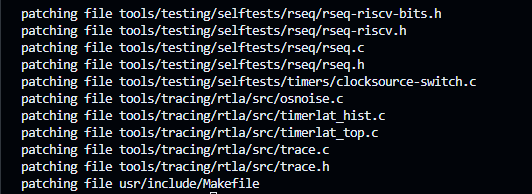
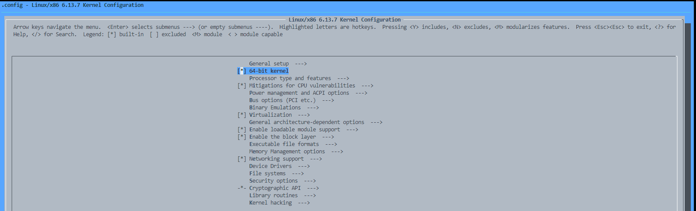
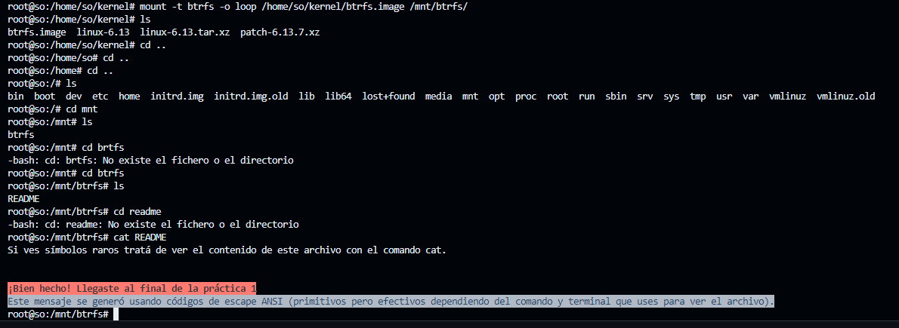

# Sistemas Operativos - Práctica 1 
## A - Introducción  

1. ¿Qué es GCC?  
GCC es un compilador integrado del proyecto GNU para C, C++, Objective C y Fortran; es capaz de recibir un programa fuente en cualquiera de estos lenguajes y generar un programa ejecutable binario en el lenguaje de la máquina donde ha de correr. La sigla GCC significa "GNU Compiler Collection".
```bash
gcc hola.c
# Compila el programa en C hola.c, genera un archivo ejecutable a.out
```

2. ¿Qué es make y para qué se usa?  
`Make`es un programa de automatización de compilación. Gestiona la construcción de programas a partir de su código fuente, definiendo las reglas y dependencias necesarias para compilar cada archivo. 
Si un archivo fuente se modifica, `make`recompila solo los archivos afectados. 
Lee una descripción de un proyecto desde un archivo conocido por `makefile`donde se automatiza el proceso sin tener que escribir manualmente cada comando de compilación. 
```bash 
programa: main.o funciones.o
	gcc -o programa main.o funciones.o

main.o: main.c funciones.h
	gcc -c main.c

funciones.o: funciones.c funciones.h
	gcc -c funciones.c

clean:
	rm -f *.o programa
```
y luego para compilar el programa, que ejecutará la primera regla y sus dependencias:
```bash
make
```

**Estructura de una regla**
```makefile
target: dependencies
	[TAB] command
```
🔹 `target`: Es el objetivo que querés construir. Puede ser: el nombre de un archivo que se va a generar (por ejemplo, un ejecutable como main, o un archivo .o) o puede ser un alias para un conjunto de comandos, como clean, all, run, etc.

🔹 `dependencies` (dependencias): son los archivos que el target necesita para construirse. Si alguno cambia, se ejecutan los comandos.

🔹 `command`: es el o los comandos de shell que se ejecutan para construir el target.

3. La carpeta `/home/so/practica1/ejemplos/01-make` de la VM contiene ejemplos de uso de `make`. Analice los ejemplos, en cada caso ejecute `make` y luego `make run` (es opcional ejecutar el ejemplo 4, el mismo requiere otras dependencias que no vienen preinstaladas en la VM):  
   - a. Vuelva a ejecutar el comando `make`. ¿Se volvieron a compilar los programas? ¿Por qué?  
   - b. Cambie la fecha de modificación de un archivo con el comando `touch` o editando el archivo y ejecute `make`. ¿Se volvieron a compilar los programas? ¿Por qué?  
   - c. ¿Por qué “run” es un target “phony”?  
   - d. En el ejemplo 2 la regla para el target `dlinkedlist.o` no define cómo generar el target, sin embargo, el programa se compila correctamente. ¿Por qué es esto?  

4. ¿Qué es el kernel de GNU/Linux? ¿Cuáles son sus funciones principales dentro del sistema operativo?  
El kernel de GNU/Linux es el núcleo del sistema operativo, es decir, la capa de software que se encarga de la comunicación entre el hardware y las aplicaciones. 
Funciones principales del kernel:
- **Gestión de procesos**: manejo de prioridad de procesos y planificación. Asignación de tiempo de CPU a los procesos.
- **Gestión de memoria**: asignación y liberación de memoria para los procesos en ejecución. Administra la memoria RAM y la virtual. 
- **Gestión del sistema de archivos**
- **Gestión de dispositivos**: comunicación con el hardware mediante drivers. 
- **Gestión de seguridad y permisos**: proporciona aislamiento entre procesos para evitar accesos no autorizados. 
- **Gestión de redes**


5. Explique brevemente la arquitectura del kernel Linux teniendo en cuenta: tipo de kernel, módulos, portabilidad, etc.
- **Tipo de kernel**: es un **kernel monolítico modular**, lo que significa que todo el sistema central (gestión de procesos, memoria, dispositivos, etc.) opera en el mismo espacio de memoria (monolítico), pero con soporte para cargar y descargar módulos de manera dinámica (modularidad).
- **Módulos del kernel**: permite cargar y descargar módulos _(kernel modules o LKM - Loadable Kernel Modules)_, lo que evita la necesidad de recompilar el kernel completo cuando se requiere soporte para nuevos dispositivos o funciones.
- **Portabilidad**: es altamente portable y funciona en diferentes arquitecturas de hardware, desde computadoras personales (x86, x86_64) hasta dispositivos móviles y embebidos.
Se divide en varias capas: 
- Espacio de usuario: contiene aplicaciones y herramientas. Utiliza syscalls para comunicarse con el kernel. 
- Llamadas al sistema (System Calls): funciones del kernel que permiten a los programas solicitar servicios como abrir archivos, asignar memoria, etc. 
- Capa del Kernel: gestion de procesos, gestión de memoria, etc.
- Capa de abstracción de hardware: el kernel interactúa con diferentes arquitecturas de hardware de forma genérica.
- Hardware: CPU, RAM, etc. 

6. ¿Cómo se define el versionado de los kernels Linux en la actualidad?  
```bash
<Major>.<Minor>.<Patch>
```
Donde:
- Major (Mayor): Cambia en eventos excepcionales (muy raro). Indica cambios profundos en la arquitectura del kernel.
- Minor (Menor): Se incrementa con cada nueva versión estable del kernel.
- Patch (Corrección): Se usa para actualizaciones de mantenimiento o seguridad dentro de una versión estable.

7. ¿Cuáles son los motivos por los que un usuario/a GNU/Linux puede querer recompilar el kernel?  
Para optimizar el rendimiento (eliminar módulos innecesarios), agregar soporte para hardware nuevo, habilitar o deshabilitar características del kernel, agregar parches de seguridad, etc. 

8. ¿Cuáles son las distintas opciones y menús para realizar la configuración de opciones de compilación de un kernel? Cite diferencias, necesidades (paquetes adicionales de software que se pueden requerir), pros y contras de cada una de ellas.  
Las alternativas para configurar el nuevo kernel corresponden: 
- `make config`: interfaz primitivo basado en modo texto. Sin ayuda ni menúes. 
- `make menuconfig`: requiere un terminal y un sistema de compilación básico (incluye GNU, gcc y make). Utiliza una librería que permite generar una interfaz con paneles desde la terminal. 
- `make xconfig`: provee interfaces gráficas. Es menos eficiente en términos de recursos ya que requiere un entorno gráfico instalado y configurado. 

9. Indique qué tarea realiza cada uno de los siguientes comandos durante la configuración/compilación del kernel:  

   - a. `make menuconfig`: Inicia la interfaz de configuración menuconfig. Se puede habilitar o deshabilitar características del kernel, ajustar configuraciones de hardware, etc. 
   - b. `make clean`: se eliminan todos los archivos generados durante el proceso de compilación anterior. De forma que no queden archivos residuales.
   - c. `make` (investigue la funcionalidad del parámetro `-j`): `make` busca el archivo Makefile, interpreta sus directivas y compila el kernel. El parámetro `-j` se utiliza para especificar el número de trabajos paralelos que pueden ejecutarse durante la compilación. 
   - d. `make modules` (utilizado en antiguos kernels, actualmente no es necesario): compila unicamente los módulos del kernel, es decir, las partes del kernel que pueden cargarse y descargarse dinámicamente en tiempo de ejecución.  
   - e. `make modules_install`: después de compilar los módulos del kernel, este comando instala los mo´dulos compilados en el directorio. 
   - f. `make install` : instala el kernel compilado en el sistema. Copia el kernel y los archivos necesarios al directorio de arranque del sistema. Actualiza la configuración del cargador de arranque para que pueda arrancar el nuevo kernel. 


10. Una vez que el kernel fue compilado:  
    - ¿Dónde queda ubicada su imagen?
        Queda ubicado en `directorio-del-código/arch/arquitectura/boot/`. 
    - ¿Dónde debería ser reubicada?  
        Reubicada en el directorio `/boot`
    - ¿Existe algún comando que realice esta copia en forma automática?  
        Sí, el comando `sudo make install`

11. ¿A qué hace referencia el archivo `initramfs`? ¿Cuál es su funcionalidad? ¿Bajo qué condiciones puede no ser necesario?  
Es un sistema de archivos temporal que se monta durante el arranque del sistema. Proporciona un entorno mínimo y temporal que permite al sistema operativo cargar los controladores necesarios, montar el sistema de archivos raíz real y completar el proceso de inicio. Contiene ejecutables, drivers y módulos necesarios para lograr iniciar el sistema. Luego del proceso de arranque el disco se desmonta. 

12. ¿Cuál es la razón por la que, una vez compilado el nuevo kernel, es necesario reconfigurar el gestor de arranque?  
- El nuevo kernel debe ser detectado: El gestor de arranque carga el sistema operativo, pero solo reconoce los kernels configurados en su archivo de configuración. Si no se actualiza, el sistema seguirá arrancando con el kernel antiguo.
- Ubicación de la imagen del kernel: cuando se instala el nuevo kernel, su imagen `(vmlinuz-*)` se guarda en `/boot/`. Se debe actualizar GRUB para que apunte a la nueva versión.
- Actualización del `initramfs`: `initramfs` es una imagen de disco temporal necesaria para que el kernel acceda a los dispositivos antes de montar el sistema de archivos principal. Debe regenerarse para que el nuevo kernel tenga los módulos correctos.

13. ¿Qué es un módulo del kernel? ¿Cuáles son los comandos principales para el manejo de módulos del kernel?  
Es un fragmento de código que puede cargarse/descargarse en el mapa de memoria del SO (kernel) bajo demanda. Éstos permiten extender la funcionalidad del kernel sin la necesidad de reiniciar el sistema. Se ubican en `/lib/modules/version` del kernel. 
Comandos principales: 
- `modprobe`: se utiliza para cargar un módulo del kernel en la memoria en tiempo de ejecución. 
- `insmod`: carga un módulo del kernel en la memoria. No maneja automáticamente las dependencias del módulo. 
- `rmmod`: se utiliza para eliminar - descargar un módulo del kernel de la memoria. 
- `lsmod`: muesrta un listado de los módulos del kernel que están actualmente cargados en la memoria del sistema. 
- `depmod`: se utiliza para generar y manipular los archivos de dependencia de los módulos del kernel. 


14. ¿Qué es un parche del kernel?  
Es un mecanismo que permite aplicar actualizaciones sobre una versión base. Se base en aarchivos diff, que indican que agregar y qué quitar. 
kernel.org tiene 2 tipos: 
- No incrementales: se aplican sobre la versión mainline anterior. 
- Incrementales: Se aplican sobre la versión inmediatamente anterior. 
    - ¿Cuáles son las razones principales por las que se deberían aplicar parches en el kernel?  
    Pemiten agrgar funcionalidad (nuevos drivers, correcciones menores, etc.)
    - ¿A través de qué comando se realiza la aplicación de parches en el kernel?
    Toma un archivo de pache como entrada y aplica los cambios especificados en el código fuente del kernel.
    ```
    patch -p <num> <achivo_parche>
    ```  

15. Investigue la característica *Energy-aware Scheduling* incorporada en el kernel 5.0 y explique brevemente:  
Optimiza la asignación de procesos a los núcleos del procesador, teniendo en cuenta no solo el rendimiento sino también el consumo energético. 

    - a. ¿Qué característica principal tiene un procesador ARM *big.LITTLE*?  
    Combina núcleos de alto rendimiento (big) y núcleos de bajo consumo (Littke) en un mismo chip.  Diseñado para tareas intensivas que requieren mayor potencia de cómputo, mientras que los Little son más eficientes en consumo energético y se usan para tareas menos exigentes. 

    - b. En un procesador ARM *big.LITTLE* y con esta característica habilitada, cuando se despierta un proceso, ¿a qué procesador lo asigna el *scheduler*?  
    El scheduler pimero intenta asignar el proceso a un núcleo LITTLE si la carga del sistema es baja, priorizando la eficiencia energética. Solo si los núcleos LITTLE están saturados o la tarea requiere más rendimiento, el proceso es migrado a un núcleo *big*.
    - c. ¿A qué tipo de dispositivos cree que beneficia más esta característica?  
    Beneficia a los dispositovs móviles, portátiles, etc. con el objetivo de prolongar la duración de la batería y evitar sobrecalentamiento. 

16. Investigue la *system call* `memfd_secret()` incorporada en el kernel 5.14 y explique brevemente:  
    - a. ¿Cuál es su propósito?  
    Permite crear áreas de memoria secretas que no pueden ser accedidas ni po el usuario root.  
    - b. ¿Para qué puede ser utilizada?  
    Se puede utiliza para almacenar claves criptográficas u otros datos que no deben ser expuestos a otros. 
    - c. ¿El kernel puede acceder al contenido de regiones de memoria creadas con esta *system call*?  
    No :D

---

## B - Ejercicio taller: compilación del kernel Linux 
1. Descargue los siguientes archivos en un sistema GNU/Linux moderno (se recomienda el directorio `$HOME/kernel/`):  

   - a. El archivo `btrfs.image.xz` publicado en la página web de la cátedra.  
   - b. El código fuente del kernel 6.13:  
     ```
     https://mirrors.edge.kernel.org/pub/linux/kernel/v6.x/linux-6.13.tar.xz
     ```
   - c. El parche para actualizar ese código fuente a la versión 6.13.7:  
     ```
     https://cdn.kernel.org/pub/linux/kernel/v6.x/patch-6.13.7.xz
     ```

2. **Preparación del código fuente**  

   - a. Posicionarse en el directorio donde está el código fuente y descomprimirlo:  
     ```sh
     cd $HOME/kernel/
     tar xvf /usr/src/linux-6.13.tar.xz
     ```
     > Comentario: `$tar xvf ./linux-6.13.tar.xz` 
   - b. Emparchar el código para actualizarlo a la versión 6.8 usando `patch`:  
     ```sh
     cd $HOME/kernel/linux-6.13
     xzcat /usr/src/patch-6.13.7.xz | patch -p1
     ```
     > Comentario: `$ xzcat ../patch-6.13.7 | patch -p1` 
     

3. **Pre-configuración del kernel**  

   - a. Usaremos como base la configuración del kernel actual, esta configuración por convención se encuentra en el directorio /boot. Copiaremos y renombraremos la configuración actual al directorio del código fuente con el comando: 
     ```sh
     cp /boot/config-$(uname -r) $HOME/kernel/linux-6.13/.config
     ```

   - b. Generar una configuración adecuada para esta versión del kernel con `olddefconfig`. `olddefconfig` toma la configuración antigua que acabamos de copiar y la actualiza con valores por defecto para las opciones de configuración nuevas:  
     ```sh
     cd $HOME/kernel/linux-6.13
     make olddefconfig
     ```
   - c. A fin de configurar el kernel a medida para la máquina virtual usaremos a continuación `localmodconfig` que configura como módulos los módulos del kernel que se encuentran cargados en este momento deshabilitando los módulos no utilizados. Es probable que `make` pregunte por deterinadas opciones de configuración, si eso sucede presionaremos la tecla `Enter` en cada opción para que quede el valor por defecto hasta que `make` finalice:  
     ```sh
     make localmodconfig
     ```

4. **Configuración personalizada del kernel**. Utilizaremos la herramienta `menuconfig` para configurar otras opciones.
   - Ejecutar `menuconfig`:  
     ```sh
     make menuconfig
     ```
   - Habilitar las siguientes opciones:  
     - *File Systems* → *Btrfs filesystem support*  
     - *Device Drivers* → *Block Devices* → *Loopback device support*  
   - Deshabilitar las siguientes opciones:  
     - *General setup* → *Configure standard kernel features (expert users)*  
     - *Kernel hacking* → *Kernel debugging*  



5. **Compilación del kernel**  
   ```sh
   make -jX
   ```
  Sea X la cantidad de procesadores. 

6. Finalizado este proceso, debemos reubicar las nuevas imágenes en los directorios correspondientes, instalar los módulos, crear una imagen initramfs y reconfigurar nuestro gestor de arranque. En general todo esto se puede hacer de forma automatizada con los siguientes comandos:
  ```sh
  make modules_install
  make install
  ```

7. Como último paso, a través del comando reboot, reiniciaremos nuestro equipo y probaremos el nuevo kernel recientemente compilado.
  a. En el gestor de arranque veremos una nueva entrada que hace referencia al nuevo kernel. Para bootear, seleccionamos esta entrada y verificamos que el sistema funcione correctamente.
  b. En caso de que el sistema no arranque con el nuevo kernel, podemos reiniciar el equipo y bootear con nuestro kernel anterior para corregir los errores y realizar una nueva compilación.
  c. Para verificar qué kernel se está ejecutando en este momento puede usar el comando:
  ```sh
  $ uname -r
  ```

   


## C - Poner a prueba el kernel compilado

`btrfs.image.xz` es un archivo de 110MiB formateado con el filesystem **BTRFS** y luego comprimido con la herramienta **xz**. Dentro contiene un script que deberás ejecutar en una máquina con acceso a Internet (puede ser la máquina virtual provista por la cátedra) para realizar la entrega obligatoria de esta práctica.

Para acceder al script deberás descomprimir este archivo y montarlo como si fuera un disco usando el driver **"Loopback device"** que habilitamos durante la compilación del kernel.

## Usando el kernel 6.13.7 compilado en esta práctica:

1. **Descomprimir el filesystem con:**
   ```bash
   unxz btrfs.image.xz
   ```

2. **Verificar que dentro del directorio `/mnt` exista al menos un directorio donde podamos montar nuestro pseudo dispositivo.**  
   Si no existe el directorio, crearlo. Por ejemplo, podemos crear el directorio `/mnt/btrfs/`.

3. **Montar el dispositivo utilizando los siguientes comandos:**
   ```bash
   su -
   mount -t btrfs -o loop $HOME/btrfs.image /mnt/btrfs/
   ```

4. **Dirigirse a `/mnt/btrfs` y verificar el contenido del archivo `README.md`.**


