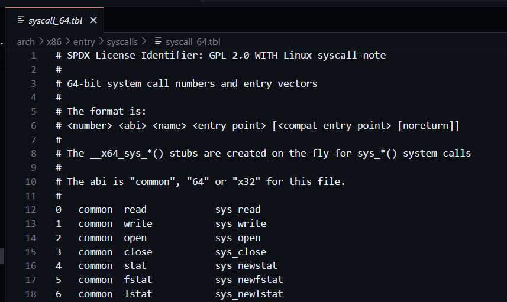

# Sistemas Operativos - Práctica 2 [2025]

## System Calls 

### Conceptos generales 
1. ¿Qué es una System Call? ¿Para qué se utiliza?
Una llamada al sistema es una rutina que permite a una aplicación de usuario solicitar acciones que requieren privilegios especiales. 
Las funciones del sistema operativo se ponen a disposición del programa de aplicación en forma de bibliotecas de programación. Un conjunto de funciones de biblioteca que se encuentran en una biblioteca como, por ejemplo, `libc.a` puede tener funciones que realizan algún proceso en modalidad de usuario y, a continuación, inician internamente una llamada al sistema.
Las funciones de sistema operativo disponibles para los programas de aplicación se pueden dividir o mover entre funciones de modalidad de usuario y funciones de modalidad de kernel según sea necesario para diferentes releases o plataformas de máquina. [^1]
 
2. ¿Para qué sirve la macro syscall? Describa el propósito de cada uno de sus parámetros
`syscall` es una función proporcionada por `glibc` para hacer system calls de forma explícita. Es más difícil de usar y menos portátil que usar las librerías (`libc`) pero aún así es ás fácil y portátil que codificar instrucciones en assembler, syscall es más útil cuando se trabaja con system calls que son especiales o más nuevas que la librería que se está usando. 

**Parámetros:**
- **Número de la system call:** indica qué system call específica se desea realizar. Es único. 
- Los parámetros restantes son parámetros de para la system call, en orden, y sus significados dependen de la system call realizada. Se permiten hasta 5. Los que están de más se ignoran. 

3. Ejecute el siguiente comando e identifique el propósito de cada uno de los archivos que encuentra 
```bash
ls -lh /boot | grep vmlinuz
```

Lo que se muestra son las imágenes del núcleo del kernel de Linux que están instaladas en el sistema. 
Su nombre indica la versión del kernel. 
Estos archivos son usados por el bootloader (GRUB) al arrancar el sistema donde carga uno de estos núcleos en memoria y lo ejecuta. 

4. Acceda al codigo fuente de GNU Linux, sea visitando https://kernel.org/ o bien trayendo el código del kernel(cuidado, como todo software monolítico son unos cuantos gigas)
```bash
git clone  https://github.com/torvalds/linux.git
```
5. ¿Para qué sirve el siguiente archivo `arch/x86/entry/syscalls/syscall_64.tbl`?
Se encarga de definir la tabla de llamadas al sistema para la arquitectura `x86_64`. Asocia cada número de **syscall** con:
- el nombre del syscall
- su función implementada en el kernel
- y el ABI (applicaction binary interface): common, 64, x32, etc.
Este archivo es usado por el kernel durante la compilación para generar el código que mapea llamadas al sistema (por ejemplo, cuando un programa hace syscall 0 se invoca __x64_sys_read).



6. ¿Para qué sirve la herramienta `strace`?¿Cómo se usa?
Es una herramienta para depurar, analizar y entender lo que hace un programa en Linux a nivel del sistema operativo.
Permite ver en tiepo real las **system calls* que realiza un programa. 
Se usa de la siguiente forma: 
- `strace ./mi_programa`: se verán todas las llamadas que realiza el programa `mi_programa`.
- `strace -e openat ./mi_programa`: para ver todas las systemcalls `open` que se realizan desde `mi_programa`.
- `strace -o salida.txt ./mi_programa`: para almacenar la salida en un archivo. 
- `strace -p <PID>`: adjuntarse a un proceso ya en ejecución. 

7. ¿Para qué sirve la herramienta `ausyscall`? ¿Cómo se usa?
`ausyscall` forma parte del sistema de auditoría de Linux. Permite:
- Consultar el número de syscall a partir de su nombre,
- consultar el nombre de syscall a partir de número,
- usarlo para escribir reglas de auditoría con `auditctl` o analizar logs de `auditd`.

### Práctica guiada

#### Agregamos una nueva System Call

1. Código de `my_sys_call.c`
● **Para qué sirven los macros SYS_CALL_DEFINE?**
Se utiliza para definir nuevas llamadas al sistema dentro del kernel. Estos macros generan la función correcta con el nombre esperado por el sistema para poder invocarla desde espacio de usuario. 

● **¿Para que se utilizan la macros `for_each_process` y `for_each_thread`?**
- `for_each_process`: se utiliza para recorrer todos los procesos del sistema. Itera sobre cada estructura `task_struct` que representa un proceso en el scheduler del kernel. 
- `for_each_thread`: recorre todos los hilos de un proceso específico. Permite iterar sobre los threads que comparten el mismo `thread group`.

● **¿Para que se utiliza la función copy_to_user?**
Se usa para copiar datos desde el espacio del kernel hacia el espacio de usuario dado que ambos ocupan manejan espacios de memoria separados entonces no se puede acceder directamente a punteros del usuario desde el kernel. 

● **¿Para qué se utiliza la función printk?, ¿porque no la típica printf?**
`printk` es la función que se usa en el kernel de Linux para imprimir mensajes de depuración o información al log del sistema. No se puede usar `printf` en el kernel porque `printf` pertenece al espacio de usuario (por ejemplo, lo usa `glibc`).

● **¿Podría explicar que hacen las sytem call que hemos incluido?**
- `my_sys_call(int arg)`:Es una syscall de prueba que simplemente recibe un número y lo imprime en el log del kernel usando printk.

- `get_task_info(char __user *buffer, size_t length)`: Recorre todos los procesos activos del sistema y guarda su información (PID, nombre, estado) en un buffer del kernel. Luego, copia ese contenido al espacio de usuario para que pueda ser leído por una aplicación. Es útil para obtener una lista de procesos en ejecución desde el usuario, de forma similar a ps.

- `get_threads_info(char __user *buffer, size_t length)`: Hace algo similar a la anterior, pero además de los procesos, también lista todos los hilos (threads) de cada proceso. Esto proporciona una vista más completa del estado del sistema, incluyendo los hilos de cada proceso.

2. Modificaremos uno de los archivos Makefile del código del Kernel para indicar la compilación de nuestro código agregado en el paso anterior: 
`kernel/Makefile`
```c
obj-y = fork.o exec_domain.o panic.o \
    cpu.o exit.o softirq.o resource.o \
    sysctl.o capability.o ptrace.o user.o \
    signal.o sys.o umh.o workqueue.o pid.o task_work.o \    
    extable.o params.o \
    kthread.o sys_ni.o nsproxy.o \
    notifier.o ksysfs.o cred.o reboot.o \
    async.o range.o smpboot.o ucount.o regset.o \
    my_sys_call.o
```

3. Añadir una entrada al final de la tabla que contiene todas las Syscalls. 


Agregar los headers al vector manejador de System calls:


4. Compilar el kernel de nuevo. 
Se ejecutó mediante 
```bash
make -jX
make modules_install
make install
```

5. Verificación de las system calls que ya sean parte del kernel 
```bash
grep get_task_info "/boot/System.map-$(uname -r)"
```


6. Creación del script que pone a prueba la ejecución de la System Call 


**Makefile**:
 ```bash
        init: prueba_syscall.c
	        gcc -o prueba_syscall prueba_syscall.c 
        run: prueba_syscall
	        ./prueba_syscall
        clean:
	        rm -f prueba_syscall 
```

#### Monitoreando System Calls 
1. Ejecuta el programa anteriormente compilado 
```
./get_task_info
```
2. Ejecute 
```
sudo dmesg
```


`dmesg` muestra mensajes del kernel de Linux, del ring buffer (buffer circular: estructura de datos que tiene un tamaño fijo, cuando llega al final, vuelve al inicio y empieza a sobreescribir los datos más antiguos).
El output son mensajes generados por el kernel. Cada línea normalmente tiene este formato:
```cpp
[ 123.456789] usb 1-1: new high-speed USB device number 4 using ehci-pci
```
Explicación:
- `[ 123.456789]` → Tiempo desde que se encendió el sistema (uptime en segundos).
- `usb 1-1`: → El componente del sistema que generó el mensaje (en este caso, el controlador USB).
- `new high-speed USB device... `→ Descripción del evento (acá, detectó un nuevo dispositivo USB).

3. Ejecute el programa anterior con la siguiente herramienta:`
```bash
#En mi caso el programa se llama de esta forma 
strace ./prueba_syscall
```
La salida se encuentra en [salida.txt](https://github.com/solccast/kernel-vm-personal/commit/3f07c7be0ad03a59e7d0c42b40b7e5a0c202464d) , línea 30. Al ejecutar el echo nos sale el número de system call que se ejecutó 


## Módulos y Drivers 

### Conceptos generales

1. ¿Cómo se denomina en GNU/Linux a la porción de código que se agrega al kernel en tiempo de ejecución? ¿Es necesario reiniciar el sistema al cargarlo? Si no se pudiera utilizar esto ¿cómo deberíamos hacer para proveer la misma funcionalidad en GNU/Linux?
Se denomina **módulo del kernel** o **kernel Module**. Suelen tener extensión `.ko` (kernel object). 
Pueden cargarse y descargarse en tiempo de ejecución. 
```bash
sudo insmod mi_modulo.ko     # Carga el módulo
sudo rmmod mi_modulo         # Lo descarga
```
En caso de que el kernel no admitiera módulos (monolítico sin soporte de carga dinámica) la forma de agregar más funcionalidad sería así: 
    1. Agregar el código directamente al kernel fuente.
    2. Recompilar el kernel completo.
    3. Reiniciar el sistema. 

2. ¿Qué es un driver? ¿Para qué se utiliza?
Un **driver** es un módulo o programa que le dice al sistema operativo cómo interactuar con un hardware específico. Sirve para que el sistema pueda usar hardware de forma genérica, sin tener que saber cómo funciona internamente. 
Se pueden cargar con `modprobe`. 
Aparecen en `/lib/modules$(uname -r)/`

3. ¿Por qué es necesario escribir drivers?
Dado que cada dispositivo es diferente y tiene su propia forma de funcionar el sistema operativo no puede incluir soporte nativo para todos los dispositivos. A parte, favorece al aislamiento y modularidad ya que separan el código del sistema operativo del manejo específico del hardware. 
Un drive generalmente está implementado como módulo del kernel pero también puede formar parte del núcleo desde el arranque (incluido directamente en el archivo `vmlinuz`)

4. ¿Cuál es la relación entre módulo y driver en GNU/Linux?
Un driver es el software que permite al sistema operativo comunicarse con un dispositivo (como una impresora, tarjeta de red, USB, etc). 
Un módulo es una forma de cargar ese driver en el kernel dinámicamente, en tiempo de ejecución.
Entonces:  Un driver puede estar implementado como un módulo del kernel.
5. ¿Qué implicancias puede tener un bug en un driver o módulo?
Debe tenerse en cuenta un driver corre en el espacio del **modo privilegiado** o **modo kernel** por lo tanto no hay protección de memoria, tienen acceso total a todos los recursos del sistema. 
Puede implicar:
- Bloqueo del sistema (kernel panic)
- Caída del rendimiento
- Corrupción de meoria o datos
- Vulnerabilidades de seguridad 

6. ¿Qué tipos de drivers existen en GNU/Linux?

|Tipos de drivers| Detalle|
| -- | -- | 
| de dispositivos (device drivers) | controlan dispositivos físicos | 
| de pseudo-dispositivos (virtuales) | emulan dispositivos. Ej: `/dev/null` descarta todo lo que se escribe en él; `/dev/zero` devuelve una secuencia infinita de ceros; `ramdisk` usa memoria RAM como si fuera un disco. |
| de sistema de archivos | manejan como se leen/escriben datos en distintos sistemas de archivos | 
| de bus | controlan como se comunican los dispositivos conectados mediante buses. Ej: `usbcore` para USB; `pci_generic` para PCI. |
| de virtualización / hypervisores | permiten que Linux corra sobre o dentro de máquinas virtuales | 
| de energía / sensores | controlan funciones como la administración de energía, de ventiladores, de temperatura. |

7. ¿Qué hay en el directorio /dev? ¿Qué tipos de archivo encontramos en esa ubicación?
Contiene archivos de dispositivos. Son interfaces entre el sistema operativo y los dispositivos. 
Hay dos tipos principales de archivos de dispositivo: 
- **Archivos de dispositivo de carácter (chardevice) - c**: transfieren datos byte a byte (como un flujo). Ej: teclados, mouse, puertos serie.
- **Archivos de dispositivo de bloque (block device) - b**: transfieren datos por bloques con acceso aleatorio. Ej: discos, pendrives.


8. ¿Para qué sirven el archivo `/lib/modules/<version>/modules.dep` utilizado por el comando `modprobe`?
Es un archivo de dependneicas que mantiene una listade qué módulos del kernel dependen de otros. 
Cuando se quiere cargar un módulo con: 
```bash
modprobe nombre_modulo
```
`modprobe`: consulta `modules.dep`, ve si ese módulo necesita otros módulos para funcionar y en caso de que así sea, carga todas las dependencias en el orden correcto.  

9. ¿En qué momento/s se genera o actualiza un `initramfs`?
`initframs` es iun archivo comprimido que contiene un pequeño sistema de archivos usado temporalmente durante el arranque del sistema y se almacena en `/boot/initrd-img-<version>`.
Se genera o actualiza:
- al instalar o actualizar el kernel
- al instalar nuevos módulos (necesarios para el arranque) del kernel
- al modificar configuraciones relacionadas al arranque 

10. ¿Qué módulos y drivers deberá tener un `initramfs` mínimamente para cumplir su objetivo?
Como el rol del `initframs` es peritir que es preparar lo mínimo necesario para que el sistema pueda montar y pasarle el control al sistema operativo entonces mínimamente el arranque del sistema deberá incluir los siguientes módulos: 
- drivers de almacenamiento: permitir acceder al disco físico donde está el sistema. 
- drivers de sistema de archivos: permiten montar el sistema de archivos raíz (`/`) como ext4, btrfs, vfat. 
- módulos del bus del sistema: para reconocer el hardware al que están conectados los discos. 
 _Módulos actuales del sistema_ 

### Práctica guiada 

#### Desarrollo de un módulo simple

#### Desarrollo de un driver

[^1]: https://www.ibm.com/docs/es/aix/7.3?topic=concepts-kernel-environment#kernextc_kern_env