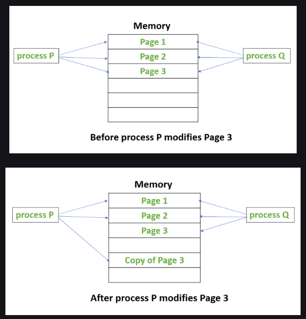

# Sistemas Operativos - Práctica 3 [2025]

## Threading (ULT y KLT)

### Conceptos generales

1. ¿Cuál es la diferencia fundamental entre un proceso y un thread?
La diferencia clave es que en el caso del thread cuando se genera éste vive en el espacio de direcciones que el proceso que lo creó y compartirá los recursos, en cambio en el caso de crear un nuevo proceso (mediante fork) éste contará con un nuevo espacio de direcciones con su propio contexto. 

> Un hilo es la unidad de trabajo que se puede someter a ejecución. Se ejecuta secuencialmente y es interrumpible para que el procesador pase a otro hilo. 


El uso de hilos en reemplazo de los procesos posee ventajas:
| | **Procesos** | **Hilos** |
| -- | -- | -- |
| **Context Switch**    | El SO debe intervenir para guardar el ambiente del proceso saliente y recuperar el ambiente del nuevo | Se realiza a nivel de registros y no espacio de direcciones. Lo lleva a cabo el proceso   |
| **Creación**  | Creación de un nuevo espacio de direcciones (PCB, PC). Actua el Kernel    |  Creación de una TCB, registros, PC y un espacio para el stack. Lo hace el mismo proceso sin intervención del SO. |
| **Destrucción**   | El SO interviene para eliminar la PCB del proceso saliente.   | El proceso elmina la TCB. |
| **Planificación** | Cambio de contexto continuos llevados por el SO.  | A cargo del desarrollador.    |
| **Protección**    | El SO garantiza la seguridad entre procesos.  | Un hilo puede bloquear la ejecución de otros. Todos los hilos comparten el mismo espacio de direcciones.  |

>Un proceso puede verse como una colección de uno o más hilos. Para ejecutar otro proceso, se debe llevar adelante un cambio de contexto. 

2. ¿Qué son los User-Level Threads (ULT) y cómo se diferencian de los Kernel-Level Threads (KLT)?

- **ULT**: Son hilos gestionados completamente por una biblioteca a nivel de usuario sin intervención directa del kernel. **El kernel _no se entera_ de la existencia de Threads**.
    - **Ventajas**: 
        - Comparten el espacio de direcciones. 
        - Cada proceso las planifica como le conviene. 
        - Portables ya que no dependen de características específicas del sistema operativo. 
        - Más rápidos de crear y cambiar entre ellos. 
    - **Desventajas**:
        - No se pueden ejecutar hilos del mismo proceso en distintos procesadores. 
        - Si un hilo hace una llamada bloqueante al sistema, todo el proceso se bloquea.
        - Un hilo puede monopolizar el uso de la CPU por parte del proceso. 

- **KLT**: gestionados directamente por el kernel, entonces cada hilo es conocido por éste. 
    - **Ventajas**:
        -  Si un hilo se bloquea, el kernel puede ejecutar otro hilo del mismo proceso.
        - Se pueden ejecutar en paralelo en múltiples CPUs o núcleos.
    - **Desventajas**: 
        - Cambiar de hilo implica un cambio de contexto.
        - Mator sobreccarga para crear y gestionar hilos. 

> En muchos sistemas modernos, se usa una combinación de ambos a través del modelo "many-to-many", donde múltiples ULT pueden ser mapeados a múltiples KLT.

3. ¿Quién es responsable de la planificación de los ULT? ¿y los KLT? ¿Cómo afecta esto al rendimiento en sistemas con múltiples núcleos?
En el caso de los ULT el responsable es la biblioteca en espacio de usuario y en KLT se ocupa directamente el kernel que ve y programa cada hilo como una unidad separada de ejecución.
En sistemas con múltiples núcleos los KLT se aprovechan mucho más ya que el kernel puede distribuir los hilos entre núcleos. Los hilos de un mismo proceso pueden estar ejecutándose concurrentemente en los distintos procesadores

4. ¿Cómo maneja el sistema operativo los KLT y en qué se diferencian de los procesos?
En Linux, por ejemplo, los hilos se implementan como procesos especiales usando `clone()`, y cada hilo puede tener su propio ID de hilo (TID) pero compartir recursos como memoria, archivos, etc., con sus "hermanos" del mismo proceso.

> La diferencia clave con los procesos es que los hilos comparten el mismo espacio de memoria y recursos, mientras que los procesos son más independientes y aislados.

5. ¿Qué ventajas tienen los KLT sobre los ULT? ¿Cuáles son sus desventajas?
Este tema fue desarrollado más arriba. Cuadro resumen:


6. Qué retornan las siguientes funciones:
a. `getpid()` [^1]: devuelve el ID de proceso del proceso de llamada. 
b. `getppid()` [^1]: devuelve el ID de proceso del proceso padre del proceso de llamada. 
c. `gettid()`[^2]: obtiene el identificador de hilo. En un miltiproceso todos los subprocesos tienen el mismo PID pero cada uno tiene un TID único. 
d. `pthread_self()`: devuelve el ID del hilo de llamada. 
e. `pth_self()` [^3]: devuelve el ID único del hilo en ejecución. 

7. ¿Qué mecanismos de sincronización se pueden usar? ¿Es necesario usar mecanismos de sincronización si se usan ULT?
Se pueden usar: 
- Mutex: un hilo accede a un recurso a la vez.
- Semáforos
- Barreras
- Conidiciones

Es necesario sincronizar tanto en KLT como en ULT si es que acceden a recursos compartidos. 

8. **Procesos**
    a. ¿Qué utilidad tiene ejecutar `fork()` sin ejecutar `exec()`?
    Primero tener en cuenta que al ejecutar  `fork()` crea un nuevo proceso hijo que es una copia exacta del proceso padre (ejecuta desde la línea siguiente al `fork()`). Sirve para hacer trabajo paralelo dentro del mismo programa, es útil si el hijo va a seguir ejecutando el mismo programa pero con distinto comportamiento. 
    b. ¿Qué utilidad tiene ejecutar `fork()` + `exec()`?
    Lanza un programa nuevo desde otro. `fork()` crea el proceso hijo y `exec()` en el hijo reemplaza su código y memoria por el de otro programa desde uno ya en ejecución (como una shell). El proceso padre puede continuar ejecutándose o esperar al hijo.  
    c. ¿Cuál de las 2 asigna un nuevo PID `fork()` o `exec()`?
    La instrucción `fork()` es la que se encarga de crear un nuevo proceso con un nuevo PID, en cambio `exec()` lo mantiene pero reemplaza el contenido del proceso actual. 
    d. ¿Qué implica el uso de Copy-On-Write (COW) cuando se hace `fork()`?
    Cuando un proceso crea un proceso hijo inicialmente compartirán las mismas páginas en memoria y éstas serán marcados como COW lo que significa que si alguno de estos procesos trata de modificarlas entonces se creará una copia de la página y el proceso trabajará sobre ella para que no afecte al resto de procesos[^4]. 
    
    e. ¿Qué consecuencias tiene no hacer `wait()` sobre un proceso hijo?
    En caso de que eso ocurra el proceso hijo queda como un proceso zombi: el proceso hijo terminó pero su entrada en la tabla de procesos sigue existiendo para que el padre pueda leer su estado de salida por lo que ocupa recursos del sistema. 
    f. ¿Quién tendrá la responsabilidad de hacer el `wait()` si el proceso padre termina sin hacer `wait()`?
    En este caso el que tiene la responsabilidad es tomado por el proceso `init` o `systemd` (PID 1)

9. **Kernel Level Threads**
    a. ¿Qué elementos del espacio de direcciones comparten los threads creados con `pthread_create()`?
    Al ser creados por el mismo proceso comparten: segmento de código, segmento de datos, heap, etc. Entonces: comparten todo el espacio de direcciones del proceso, salvo sus propias pilas y registros.  
    b. ¿Qué relaciones hay entre `getpid()` y `gettid()` en los KLT?
    Todos los hilos de un proceso tienen el mismo PID, pero cada uno tiene su propio TID. 
    c. ¿Por qué `pthread_join()` es importante en programas que usan múltiples hilos? ¿Cuándo se liberan los recursos de un hilo zombie?
    Es importante ya que espera a que el hilo termine y recupera su valor de retorno y evita que quede como zombie. Los recursos asociados no se liberan hasta que se hace `pthread_join`.  
    d. ¿Qué pasaría si un hilo del proceso bloquea en `read()`? ¿Afecta a los demás hilos?
    No, el kernel solo bloquea ese hilo pero no a todo el proceso. 
    e. Describí qué ocurre a nivel de sistema operativo cuando se invoca `pthread_create()` (¿es syscall? ¿usa `clone`?).
    Al ejecutar `pthread_create()` se hace una llamada al sistema (`clone()`) que permite crear un nuevo hilo. Esta syscall permite especificar qué recursos se comparten. El kernel crea una nueva estructura de hilo (`task_struct`). 

10. **User Level Threads**
a. ¿Por qué los ULTs no se pueden ejecutar en paralelo sobre múltiples núcleos?
No se pueden ejecutar porque en paralelo porque el SO desconoce la existencia de estos hilos por lo tanto solo uno puede ejecutarse a la vez. 


b. ¿Qué ventajas tiene el uso de ULTs respecto de los KLTs?
        Se hizo enfásis en las ventajas en puntos anteriores, sin embargo como resumen tenemos que ULTs tiene como ventaja por sobre KLTs:
            - Menor overhead
            - Portabilidad
            - Mayor control de planificación
            - Cambio de contexto más rápido

c. ¿Qué relaciones hay entre `getpid()`, `gettid()` y `pth_self()` (en GNU Pth)?

d. ¿Qué pasaría si un ULT realiza una syscall bloqueante como `read()`?
        Todo el proceso se bloquea. Como mencioné antes, el kernel desconoce la existencia de estos hilos entonces ve a todos estos como un proceso por lo que el resto de ULTs se quedan esperando. 
e. ¿Qué tipos de scheduling pueden tener los ULTs? ¿Cuál es el más común?
    Los más comunes:
        - Cooperativo: los hilos ceden voluntariamente el control.
        - Round Robin: turno fijo acada hilo en orden.
        - Por prioridades

> No hay paralelismo real, solo concurrencia cooperativa dentro de un solo núcleo. 

11. **Global Interpreter Lock**
a. ¿Qué es el GIL (Global Interpreter Lock)? ¿Qué impacto tiene sobre programas multi-thread en Python y Ruby?
El GIL se refiere al mecanismo interno de control que garantiza que solo un hilo de ejecución acceda a objetos en un momento dado. Previene las _race conditions_. En conclusión, permite que **solo un hijo ejecute bytecode a la vez** en el intérprete. [^5]
b. ¿Por qué en CPython o MRI se recomienda usar procesos en vez de hilos para tareas intensivas en CPU?
Porque los hilos están limitados por el GIL así que no pueden correr en paralelo real, en cambio cada proceso tiene su propio intérprete y su propio GIL por lo que pueden ejecutarse en simultáneo. 

### Práctica guiada 

1. Instale las dependencias necesarias para la práctica (strace, git, gcc, make, libc6-dev,
libpth-dev, python3, htop y podman):
```bash
apt update
apt install build-essential libpth-dev python3 python3-venvstrace git htop podman

```

2. Clone el repositorio con el código a usar en la práctica
```bash
git clone https://gitlab.com/unlp-so/codigo-para-practicas.git
```

3. Resuelva y responda utilizando el contenido del directorio `practica3/01-strace`:
a. Compile los 3 programas C usando el comando `make`.

b. Ejecute cada programa individualmente, observe las diferencias y similitudes del PID y THREAD_ID en cada caso. Conteste en qué mecanismo de concurrencia las distintas tareas:
i. Comparten el mismo PID y THREAD_ID
ii. Comparten el mismo PID pero con diferente THREAD_ID
iii. Tienen distinto PID

**Ejecución:**
`01-subprocess`: Tienen diferente PID  -> `fork()`: crea un nuevo proceso pero no un hilo. 
```bash
Parent process: PID = 4165, THREAD_ID = 4165
Child process: PID = 4166, THREAD_ID = 4166
```
`02-kl-thread`: Comparten el mismo PID pero con diferente THREAD_ID -> klt
```bash
Parent process: PID = 4204, THREAD_ID = 4204
Child thread: PID = 4204, THREAD_ID = 4205
```
`03-ul-thread`: Comparten el mismo PID y THREAD_ID -> ult
```bash
Parent process: PID = 4231, THREAD_ID = 4231, PTH_ID = 94182215788784
Child thread: PID = 4231, THREAD_ID = 4231, PTH_ID = 94182215791328
```

c. Ejecute cada programa usando strace (`strace ./nombre_programa > /dev/null)` y responda:
i. ¿En qué casos se invoca a la systemcall `clone` o `clone3` y en cuál no? ¿Por qué?
Se ejecuta en el primer caso, en el segundo también con `clone3` pero en el último no porque `clone()` es una syscall que lo atiende el kernel y el código muestra la creación de un ULT (en el espacio de usuario) entonces éste nuevo proceso hijo no es visible para el sistema operativo.

ii. Observe los flags que se pasan al invocar a `clone` o `clone3` y verifique en qué caso se usan los flags `CLONE_THREAD` y `CLONE_VM`.
- `CLONE_VM`: se usa en el caso que se busque compartir el espacio de memoria. Se usa en el caso del código 2.
- `CLONE_THREAD`: también se usa en el código 2 ya que realmente se crean hilos, entonces ese flag indica que el proceso creado forma parte del mismo grupo de hilos del proceso padre (comparten PID). Convierte un proceso creado con clone en un hilo real (KLT)

iii. Investigue qué significan los flags `CLONE_THREAD` y `CLONE_VM` usando la manpage de clone y explique cómo se relacionan con las diferencias entre procesos e hilos.

```bash
CLONE_THREAD (since Linux 2.4.0)
    If  CLONE_THREAD  is  set,  the  child  is  placed  in  the  same  thread group as the calling process.  
    The threads within a group can be distinguished by their (system-wide) unique thread IDs (TID).  A new thread's TID is available  as  the  function result returned to the caller, and a thread can obtain its own TID using gettid(2).

CLONE_VM (since Linux 2.0)
              If CLONE_VM is set, the calling process and the child process run in the same memory space.  In particular, memory writes performed by the  calling
              process  or  by  the child process are also visible in the other process.  Moreover, any memory mapping or unmapping performed with mmap(2) or mun‐
              map(2) by the child or calling process also affects the other process.

              If CLONE_VM is not set, the child process runs in a separate copy of the memory space of the calling process at the time of the clone call.  Memory
              writes or file mappings/unmappings performed by one of the processes do not affect the other, as with fork(2).
```
Característica | Proceso (fork) | Hilo (clone + flags)
| -- | -- | -- |
Memoria | Separada | Compartida (CLONE_VM)
PID | Distinto | Igual (grupo de hilos) con CLONE_THREAD
Archivos abiertos | Copia separada | Compartidos (CLONE_FILES)
Señales | Independientes | Compartidas (CLONE_SIGHAND)

iv. `printf()` eventualmente invoca la syscall write (con primer argumento 1, indicando que el file descriptor donde se escribirá el texto es STDOUT). Vea la salida de strace y verifique qué invocaciones a write(1, ...) ocurren en cada caso.
- Caso `01-subprocess`: `write(1, "Parent process: PID = 6343, THRE"..., 45) = 45` 
- Caso `02-kl-thread`: `write(1, "Parent process: PID = 6374, THRE"..., 88) = 88`
- Caso `03-ul-thread`: `write(1, "Parent process: PID = 6461, THRE"..., 138) = 138` 
En los tres casos se pasa como argumento la salida estándar. 

v. Pruebe invocar de nuevo strace con la opción -f y vea qué sucede respecto a las invocaciones a write(1, …). Investigue qué es esa opción en la manpage de strace. ¿Por qué en el caso del ULT se puede ver la invocación a write(1, …) por parte del thread hijo aún sin usar -f?
```bash
       -f
       --follow-forks
                   Trace child processes as they are created by currently traced processes as a result of the fork(2), vfork(2) and clone(2) system calls.   Note
                   that -p PID -f will attach all threads of process PID if it is multi-threaded, not only thread with thread_id = PID.
```

4. Resuelva y responda utilizando el contenido del directorio `practica3/02-memory`:
a. Compile los 3 programas C usando el comando make.
b. Ejecute los 3 programas.
- `01-subprocess`:
```bash
Parent process: PID = 7281, THREAD_ID = 7281
Parent process: number = 42
Child process: PID = 7282, THREAD_ID = 7282
Child process: number = 84
Parent process: number = 42
```
- `02-kl-thread`:
```bash
Parent process: PID = 7325, THREAD_ID = 7325
Parent process: number = 42
Child thread: PID = 7325, THREAD_ID = 7326
Child process: number = 84
Parent process: number = 84
```
- `03-ul-thread`:
```bash
Parent process: PID = 7363, THREAD_ID = 7363, PTH_ID = 94282563832048
Parent process: number = 42
Child thread: PID = 7363, THREAD_ID = 7363, PTH_ID = 94282563834592
Child thread: number = 84
Parent process: number = 84
```
c. Observe qué pasa con la modificación a la variable number en cada caso. ¿Por qué suceden cosas distintas en cada caso?
En el primer caso se usa `fork()`, esta syscall genera un proceso hijo con su propia copia del espacio de memoria (copy on write), entonces el proceso hijo al modificar la variable `number` solo estaría modificando su copia. 
En el caso de `02-kl-thread` todos los hilos comparten el mismo espacio de direcciones (por las flags que se probaron anteriormente) entonces la modificación de la variable se propaga.
En `03-ul-thread` ocurre lo mismo que en el caso anterior, todos los hilos viven en el mismo espacio de direcciones que el proceso padre entonces comparten la misma variable.  

5. El directorio `practica3/03-cpu-bound` contiene programas en C y en Python que ejecutan una tarea CPU-Bound (calcular el enésimo número primo).
a. Ejecute `htop` en una terminal separada para monitorear el uso de CPU en los siguientes incisos.
b. Ejecute los distintos ejemplos con `make` (usar `make help` para ver cómo) y observe cómo aparecen los resultados, cuánto tarda cada thread y cuanto tarda el programa completo en finalizar.
```bash
#En htop podemos observar como se generan los diferentes hilos y son vistos por el kernel
# Todos los hilos ejecutan en paralelo
make run_klt
./klt
Starting the program.
[Thread 140430819923648] Doing some work...
[Thread 140430786352832] Doing some work...
[Thread 140430803138240] Doing some work...
[Thread 140430811530944] Doing some work...
[Thread 140430794745536] Doing some work...
2500000th prime is 41161739
[Thread 140430803138240] Done with work in 78.364010 seconds.
2500000th prime is 41161739
[Thread 140430811530944] Done with work in 78.490711 seconds.
2500000th prime is 41161739
[Thread 140430786352832] Done with work in 78.590463 seconds.
2500000th prime is 41161739
[Thread 140430794745536] Done with work in 78.677855 seconds.
2500000th prime is 41161739
[Thread 140430819923648] Done with work in 78.906294 seconds.
All threads are done in 78.907328 seconds
```

```bash
#En este caso es un único proceso el q ue se encarga de realizar la tarea (por más que en el código tengan hilos).. 
# Los hijos se ejecutan de forma secuencial, es decir, cuando se termina de ejecutar un hilo, recién ejecuta el que sigue
make run_ult
./ult
Starting the program.
[Thread 94498693063392] Doing some work...
2500000th prime is 41161739
[Thread 94498693063392] Done with work in 72.567070 seconds.
[Thread 94498693130448] Doing some work...
2500000th prime is 41161739
[Thread 94498693130448] Done with work in 72.515455 seconds.
[Thread 94498693197504] Doing some work...
2500000th prime is 41161739
[Thread 94498693197504] Done with work in 72.503252 seconds.
[Thread 94498693264560] Doing some work...
2500000th prime is 41161739
[Thread 94498693264560] Done with work in 72.192671 seconds.
[Thread 94498693331616] Doing some work...
2500000th prime is 41161739
[Thread 94498693331616] Done with work in 72.551345 seconds.
All threads are done in 362.000000 seconds
```

```bash
klt.py
Starting the program.
[thread_id=139879133476544] Doing some work...
[thread_id=139879125083840] Doing some work...
[thread_id=139879116691136] Doing some work...
[thread_id=139879108298432] Doing some work...
[thread_id=139878897546944] Doing some work...
500000th prime is 7368787
[thread_id=139879133476544] Done with work in 173.45918536186218 seconds.
500000th prime is 7368787
[thread_id=139879108298432] Done with work in 196.6558837890625 seconds.
500000th prime is 7368787
[thread_id=139878897546944] Done with work in 198.90486216545105 seconds.
500000th prime is 7368787
[thread_id=139879125083840] Done with work in 203.6454701423645 seconds.
500000th prime is 7368787
[thread_id=139879116691136] Done with work in 209.52642345428467 seconds.
All threads are done in 209.56584477424622 seconds
```

```bash
make run_ult_py
/home/so/practica3/codigo-para-practicas/practica3//.venv/bin/python3 ult.py
Starting the program.
[greenlet_id=139736566533952] Doing some work...
500000th prime is 7368787
[greenlet_id=139736566533952] Done with work in 40.38596296310425 seconds.
[greenlet_id=139736561222976] Doing some work...
500000th prime is 7368787
[greenlet_id=139736561222976] Done with work in 40.13271951675415 seconds.
[greenlet_id=139736566535872] Doing some work...
500000th prime is 7368787
[greenlet_id=139736566535872] Done with work in 40.74720573425293 seconds.
[greenlet_id=139736559249792] Doing some work...
500000th prime is 7368787
[greenlet_id=139736559249792] Done with work in 40.73860716819763 seconds.
[greenlet_id=139736559249952] Doing some work...
500000th prime is 7368787
[greenlet_id=139736559249952] Done with work in 42.36141777038574 seconds.
All greenlets are done in 204.38147354125977 seconds
```

```bash
podman run -it --rm --network=none -v .:/mnt docker.io/felopez/python-nogil:latest python3 -X gil=0 /mnt/klt.py
Starting the program.
[thread_id=139881867241152] Doing some work...
[thread_id=139881858848448] Doing some work...
[thread_id=139881783228096] Doing some work...
[thread_id=139881774835392] Doing some work...
[thread_id=139881766442688] Doing some work...
500000th prime is 7368787
[thread_id=139881858848448] Done with work in 101.5588047504425 seconds.
500000th prime is 7368787
[thread_id=139881766442688] Done with work in 102.01845669746399 seconds.
500000th prime is 7368787
[thread_id=139881774835392] Done with work in 102.36085486412048 seconds.
500000th prime is 7368787
[thread_id=139881867241152] Done with work in 102.57131338119507 seconds.
500000th prime is 7368787
[thread_id=139881783228096] Done with work in 103.79608988761902 seconds.
All threads are done in 103.83046793937683 seconds
```

c. ¿Cuántos threads se crean en cada caso?
- `run_klt`: 5 hilos
- `run_ult`: 5 hilos 
- `run_klt_py`: 5 hilos 
- `run_ult_py`: 5 hilos
- `run_klt_py_nogil`: 5 hilos

d. ¿Cómo se comparan los tiempos de ejecución de los programas escritos en C (ult y klt)?
Es notoria la diferencia, se nota el paralelismo del klt (se ve en `htop` los procesos hijos) a diferencia del ult en el que el kernel solo conoce a un proceso (padre).

e. ¿Cómo se comparan los tiempos de ejecución de los programas escritos en Python (ult.py y klt.py)?
Es notoria la diferencia que existe entre klt normal y klt sin gil, es el que menos tarda, entonces los hilos pueden ejecutar código python en paralelo real. 
En el caso del ULTs es que cooperan y cambiande contexteo voluntariamente. Sigue siendo secuencial pero este scheduler reduce el overhead. 

f. Modifique la cantidad de threads en los scripts Python con la variable `NUM_THREADS` para que en ambos casos se creen solamente 2 threads, vuelva a ejecutar y comparar los tiempos. ¿Nota algún cambio? ¿A qué se debe?

**`NUM_THEADS=2`**

```bash
#run_klt_py
Starting the program.
[thread_id=139967727396544] Doing some work...
[thread_id=139967718987456] Doing some work...
500000th prime is 7368787
[thread_id=139967727396544] Done with work in 102.97450184822083 seconds.
500000th prime is 7368787
[thread_id=139967718987456] Done with work in 107.63996481895447 seconds.
All threads are done in 107.64879822731018 seconds
```

```bash
#run_klt_py_nogil
Starting the program.
[thread_id=140107864684224] Doing some work...
[thread_id=140107856275136] Doing some work...
500000th prime is 7368787
[thread_id=140107856275136] Done with work in 80.93601560592651 seconds.
500000th prime is 7368787
[thread_id=140107864684224] Done with work in 81.51169872283936 seconds.
All threads are done in 81.53668189048767 seconds
```

```bash
#run_ult_py
Starting the program.
[greenlet_id=139923894636352] Doing some work...
500000th prime is 7368787
[greenlet_id=139923894636352] Done with work in 114.9283766746521 seconds.
[greenlet_id=139923889325376] Doing some work...
500000th prime is 7368787
[greenlet_id=139923889325376] Done with work in 108.96440649032593 seconds.
All greenlets are done in 223.96445417404175 seconds
```


g. ¿Qué conclusión puede sacar respecto a los ULT en tareas CPU-Bound?
Que no son óptimos xd 

6. El directorio `practica3/04-io-bound` contiene programas en C y en Python que ejecutan una tarea que simula ser IO-Bound (tiene una llamada a sleep lo que permite interleaving de forma similar al uso de IO).
a. Ejecute htop en una terminal separada para monitorear el uso de CPU en los siguientes incisos.
b. Ejecute los distintos ejemplos con make (usar make help para ver cómo) y observe cómo aparecen los resultados, cuánto tarda cada thread y cuanto tarda el programa completo en finalizar.
c. ¿Cómo se comparan los tiempos de ejecución de los programas escritos en C (ult y klt)?
d. ¿Cómo se comparan los tiempos de ejecución de los programas escritos en Python (ult.py y klt.py)?
e. ¿Qué conclusión puede sacar respecto a los ULT en tareas IO-Bound?
7. Diríjase nuevamente en la terminal a practica3/03-cpu-bound y modifique klt.py de forma
que vuelva a crear 5 threads.
a. Ejecute htop en una terminal separada para monitorear el uso de CPU en los
siguientes incisos.
b. Ejecute una versión de Python que tenga el GIL deshabilitado usando: `make
run_klt_py_nogil` (esta operación tarda la primera vez ya que necesita descargar un
container con una versión de Python compilada explícitamente con el GIL
deshabilitado).
c. ¿Cómo se comparan los tiempos de ejecución de klt.py usando la versión normal de
Python en contraste con la versión sin GIL?
d. ¿Qué conclusión puede sacar respecto a los KLT con el GIL de Python en tareas
CPU-Bound?


## Notaciones a tener en cuenta

🔹 `fork()`
- Crea un nuevo proceso (hijo) que es una copia casi exacta del proceso actual (padre).

- Ambos procesos (padre e hijo) continúan ejecutándose desde la misma línea después del `fork()`.

- El proceso hijo tiene su propio espacio de memoria, pero al principio se comparte (copy-on-write).

📌 Uso típico: cuando se busca ejecutar otro programa desde el código, como con `exec()` después de `fork()`.

🔹 `clone()`
- Permite compartir partes del contexto entre el proceso padre e hijo, como memoria, archivos abiertos, pila, etc.

- Se usa para crear hilos (threads) en Linux.

- Es la base interna de cómo se implementan los hilos con `pthread_create()`.

🔩 `CLONE_VM`
- Hace que el hijo comparta el mismo espacio de direcciones (memoria) que el proceso padre. Es decir, las variables y estructuras en RAM son las mismas para ambos.

🔗 `CLONE_THREAD`
- Hace que el proceso hijo sea tratado como un hilo dentro del proceso padre. El hilo no aparece como un proceso independiente (no nuevo PID), sino como parte del mismo proceso.
- Comparte recursos como el PID, archivos, señal de terminación, etc.

[^1]: https://www.ibm.com/docs/es/aix/7.2?topic=g-getpid-getpgrp-getppid-subroutine 
[^2]: https://www.ibm.com/docs/es/aix/7.2?topic=p-pthread-self-subroutine
[^3]: https://www.gnu.org/software/pth/pth-manual.html
[^4]: https://www.geeksforgeeks.org/copy-on-write/
[^5]: https://wiki.python.org/moin/GlobalInterpreterLock