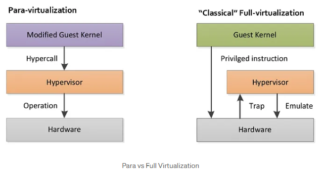

# Sistemas Operativos - Práctica 4A [2025]

## Cgroups & Namespaces

### Parte 1: Conceptos teóricos 
1. Defina **virtualización**. Investigue cuál fue la primera implementación que se realizó. 

La virtualización permite dividir los recursos de hardware de un sistema —como procesadores, memoria y almacenamiento, entre otros— entre varios sistemas virtuales, denominados máquinas virtuales (VM). Utiliza software para crear una capa de abstracción sobre el hardware del sistema.
Cada VM ejecuta su propio sistema operativo y se comporta como un ordenador independiente, aunque se esté ejecutando en una parte del hardware del sistema subyacente real.

El nacimiento de la virtualización se remonta a 1964, cuando IBM diseñó e introdujo CP-40, un proyecto de investigación experimental de tiempo compartido para el sistema/360 de IBM. El CP-40, que más tarde evolucionó hasta convertirse en el CP-67 y luego en Unix, proporcionó un hardware informático capaz de soportar múltiples usuarios simultáneos y sentó las bases de las máquinas virtuales. [^1]


2. ¿Qué diferencia existe entre virtualización y emulación?
Un emulador permite que un entorno informático replique la funcionalidad de otro, permitiendo que el software escrito para una plataforma se ejecute en otra[^2].
Los emuladores funcionan convirtiendo instrucciones destinadas a un sistema en un formato que otro sistema pueda ejecutar. Esto suele implicar:
- Traducción binaria (conversión de código de máquina de una arquitectura a otra).
- Virtualización (ejecución de software en un entorno controlado y aislado).
- Abstracción de hardware (permitir que el software interactúe con una configuración de hardware diferente).

>La emulación implica simular el hardware y el software de un sistema para que un programa se ejecute en otro, mientras que la virtualización crea entornos virtuales que imitan máquinas separadas en el mismo hardware

3. Investigue el concepto de hypervisor y responda [^3]:
(a) ¿Qué es un hypervisor?
Un **hipervisor** es la capa de software que coordina las máquinas virtuales. Sirve como interfaz entre la VM y el hardware físico subyacente, y garantiza que cada uno tenga acceso a los recursos físicos que necesita ejecutar. También se asegura de que las máquinas virtuales no interfieran entre ellas afectando al espacio de memoria o los ciclos de cálculo del resto.

(b) ¿Qué beneficios traen los hypervisors? ¿Cómo se clasifican? [^4]
**Principales beneficios**:
- Eficiencia: permite que varias áquinas vrituales utilicen el mismo hardware físico
- Escalabilidad: crean, implementan y retiran maquinas virtuales. 
- Ahorro de costos: permiten ejecutar varias áquinas virtuales en una sola áquina física. 
- Seguridad: aíslan las VM entre sí y la de máquina host. 
Hay dos tipos de hipervisores:
- **Hipervisores de tipo 1 o "bare-metal"**: interactúan con los recursos físicos subyacentes, sustituyendo por completo al sistema operativo tradicional. Son muy eficientes porque acceden directamente al hardware físico. 
- **Hipervisores de tipo 2**: se ejecutan como una aplicación en un sistema operativo existente. Normalmente se utilizan en dispositivos de punto final para ejecutar sistemas operativos alternativos e implican una sobrecarga de rendimiento porque deben utilizar el sistema operativo del host para acceder y coordinar los recursos de hardware subyacentes. Como accede a los recursos informáticos, de memoria y de red a través del sistema operativo host, introduce problemas de latencia que pueden afectar el rendimiento. 

4. ¿Qué es la **full virtualization**? ¿Y la **virtualización asistida por hardware**?
La full virtualization es una técnica de virtualización donde el hipervisor crea una VM completamente idéntica al hardware físico, de manera que el sistema operativo invitado no necesita ser modificado en absoluto. Por lo tanto el sistema operativo _invitado_ cree que está corriendo en una máquina física real. Como el sistema invitado no puede acceder directamente al hardware, el hipervisor intercepta y emula ciertas instrucciones que requieren privilegios (como acceso a dispositivos o controladores). Esto lo lograba mediante traducción binaria dinámica: el hipervisor analizaba y convertía las instrucciones privilegiadas del sistema invitado en otras seguras que no causaran conflictos con el sistema anfitrión.

La virtualización asistida por hardware es una tecnología integrada en procesadores modernos que facilita la virtualización permitiendo ejecutar instrucciones privilegiadas directamente en la CPU sin necesidad de emulación compleja. Entonces, el hipervisor peude delegar al hardware la gestión de tareas: manejo de cambios de contexto e ntre invitados y hosts, control de interrupciones y acceso a memoria, y protección del aislamiento entre VMs. 

> La virtualización completa puede implementarse con o sin soporte de hardware: la virtualización completa antes se realizaba mediante software (vinary trasnlation) y actualmente los hipervisores modernos usan la virtualización asistida por harware. 

5. ¿Qué implica la técnica **binary translation**? ¿Y **trap-and-emulate**?
- **Binary translation**: el hipervisor intercepta y traduce dinámicamente instrucciones del código del sistema operativo invitado y las reemplaza por secuencias seguras que no comprometen la estabilidad del host. Funcionamiento: 
    - El SO guest intenta ejecutar una instrucción privilegiada.
    - El hipervisor analiza bloques de código binario del invitado, los traduce a un equivalente seguro y los ejecuta. 

- **Trap and emulate**: el hipervisor permite que el sistema operativo invitado intente ejecutar instrucciones privilegiados, pero cuando lo hace, la CPU genera una trap y cede el control al hipervisor, que luego emula el comportaiento de sea instrucción. Funcionamiento: 
    - El SO guest ejecuta una instrucción privilegiada.
    - Como no tiene privilegios, la CPU lanza una excepción.
    - El hipervisor intercepta la excepción y emula la instrucción en software.
    - Devuelve el control al invitado. 

> Tanto binary translation como trap-and-emulate son técnicas que se usan para implementar virtualización completa (full virtualization) cuando el sistema invitado intenta ejecutar instrucciones privilegiadas, y no se cuenta con soporte de hardware o se busca optimizar el rendimiento.


6. Investigue el concepto de paravirtualización y responda:
(a) ¿Qué es la paravirtualización?
En este caso, la paravirtualización es una técnica donde el sistea operativo invitado es modificado explícitamente para que colabore con el hipervisor. En lugar de intentar ejecutar instrucciones privilegiadas directamente, el SO llama al hipervisor usando una interfaz definida (_hypercalls_). 
Paravirtualization eliminates the need for hardware emulation, resulting in lower overhead and improved performance compared to full virtualization.
(b) Mencione algún sistema que implemente paravirtualización.
Examples of para virtualization include Xen hypervisor with Xen-aware guest operating systems.[^5]
(c) ¿Qué beneficios trae con respecto al resto de los modos de virtualización?
- **Menor overhead**: el sistema operativo invitado colabora con el hipervisor, usando hypercalls en lugar de ejecutar instrucciones que deben interceptarse o traducirse.
- **Mejor aprovechamiento de recursos**: al eliminar parte de la complejidad del monitoreo constante del invitado, el hipervisor consume menos CPU y memoria.

> La paravirtualización sacrifica compatibilidad a cambio de rendimiento. Es ideal en entornos donde se pueden controlar los sistemas operativos invitados (como en nubes privadas, data centers, o sistemas Linux optimizados).

7. Investigue sobre containers y responda[^6]:
(a) ¿Qué son?
Son unidades ejecutables de software que empaquetan el código de la aplicación en conjunto con sus bibliotecas y dependencias. Permite que el código se ejecute en cualquier entorno informático. 
Los contenedores aprovechan una forma de virtualización del sistema operativo (SO) en la que las características del kernel del SO (namespaces y cgroups por ejemplo)se pueden usar para aislar procesos y controlar la cantidad de CPU, memoria y disco a los que esos procesos pueden acceder.

(b) ¿Dependen del hardware subyacente?
En lugar de virtualizar el hardware subyacente, los contenedores virtualizan el sistema operativo, de modo que cada contenedor contiene únicamente la aplicación y sus biblitoecas, archivos de configuración y dependencias. 

(c) ¿Qué lo diferencia por sobre el resto de las tecnologías estudiadas?
- Virtualización crea máquinas virtuales completas, cada una con su propio sistema operativo (kernel, drivers, etc.).
- Contenedores comparten el mismo kernel del sistema operativo anfitrión, pero aíslan las aplicaciones y sus dependencias en entornos separados.

(d) Investigue qué funcionalidades son necesarias para poder implementar containers.
- **Namespaces**: para aislar recursos del sistema como si fuera un entorno separado. Un contenedor puede tener su propio hostname, tabla de procesos, y red, sin ver la del host.
- **Control groups**: Permiten limitar y monitorizar el uso de recursos (CPU, RAM, disco, red, etc.) por grupo de procesos. Se pueden asignar límites y prioridades. Impiden que un contenedor acapare todo el hardware.
- **Sistema de archivos**: Permiten combinar capas de archivos de solo lectura y escritura. Esto es clave para: compartir capas comunes entre contenedores (por ejemplo, la capa base de una imagen) o crear nuevos contenedores sin duplicar todo el sistema de archivos.
- **`chroot` y `pivot_root`**: Herramientas para cambiar el root filesystem de un proceso, de modo que parezca que el contenedor vive en su propio sistema de archivos aislado.

### Parte 2: `chroot`, Control Groups y Namespaces

#### Chroot 
En algunos casos suele ser conveniente restringir la cantidad de información a la que un proceso puede acceder. Uno de los métodos más simples para aislar servicios es ``chroot`, que consiste simplemente en cambiar lo que un proceso, junto con sus hijos, consideran que es el directorio raíz, limitando de esta forma lo que pueden ver en el sistema de archivos. En esta sección de la práctica se preparará un árbol de directorios que sirva como directorio raíz para la ejecución de una shell.

1. ¿Qué es el comando `chroot`? ¿cuál es su finalidad?
El comando  cambia el directorio raíz al directorio especificado por el directorio pasado por parámetro. De este modo se puede crear un nuevo entorno separado lógicamente del directorio raíz del sistema principal. Un programa que se ejecuta en este entorno modificado no puede acceder a los archivos y comandos fuera de ese árbol de directorios del entorno. 

2. Crear un subdirectorio llamado `sobash` dentro del directorio root. Intente ejecutar el comando `chroot /root/sobash`. ¿Cuál es el resultado? ¿Por qué se obtiene ese resultado?
```bash
root@so:~/sobash# chroot /root/sobash
chroot: failed to run command ‘/bin/bash’: No such file or directory
``` 
Se obtiene ese resultado porque después del comando, el proceso pierde acceso al sistema real y todo lo que intente ejecutar debe existir dentro del nuevo root. Dado que está vacío, no hay nada que ejecutar. 

3. Cree la siguiente jerarquía de directorios dentro de `sobash`:
```bash
sobash/
├── bin
├── lib
│   └── x86_64-linux-gnu
└── lib64
```

4. Verifique qué bibliotecas compartidas utiliza el binario `/bin/bash` usando el comando `ldd /bin/bash`.¿En qué directorio se encuentra `linux-vdso.so.1`? ¿Por qué?
```bash
root@so:~/sobash# ldd /bin/bash
        linux-vdso.so.1 (0x00007f52d82bf000)
        libtinfo.so.6 => /lib/x86_64-linux-gnu/libtinfo.so.6 (0x00007f52d8140000)
        libc.so.6 => /lib/x86_64-linux-gnu/libc.so.6 (0x00007f52d7f5f000)
        /lib64/ld-linux-x86-64.so.2 (0x00007f52d82c1000)
```
`linux-vdso.so.1` es un objeto virtual compartido que no tiene ningún archivo físico en el disco; es una parte del kernel que se exporta al espacio de direcciones de cada programa cuando se carga.
El mecanismo vDSO (Objeto Dinámico Virtual Compartido) permite al kernel exportar un segmento de memoria al espacio de direcciones de un proceso. Esto permite que llamadas específicas del sistema se ejecuten en el espacio de usuario en lugar del espacio del kernel, lo que ofrece una ventaja de rendimiento al evitar la sobrecarga de un cambio de contexto.

5. Copie en `/root/sobash` el programa `/bin/bash` y todas las librerías utilizadas por el
programa bash en los directorios correspondientes. Ejecute nuevamente el comando
chroot ¿Qué sucede ahora?

```bash
#Sacado de chatgpt pero usé lo mismo 
sudo cp -v /lib/x86_64-linux-gnu/libtinfo.so.6 /root/sobash/lib/x86_64-linux-gnu/
sudo cp -v /lib/x86_64-linux-gnu/libc.so.6 /root/sobash/lib/x86_64-linux-gnu/
sudo cp -v /lib64/ld-linux-x86-64.so.2 /root/sobash/lib64/
```
Al ejecutar de nuevo el comando se tiene:
```bash
root@so:~/sobash# chroot /root/sobash
bash-5.2# echo "Hola mundo"
Hola mundo
```
Se puedo entrar al entorno. 

6. ¿Puede ejecutar los comandos `cd "directorio"` o `echo`? ¿Y el comando `ls`? ¿A qué se debe esto?
Tanto `cd` como `echo` funcionan por que el shell lo iplementa directamente. En el caso de `ls` no porque es un programa externo y no está el binario en el entorno, entonces es necesario copiarlo dentro del entorno (igual a como se hizo con bash).

7. ¿Qué muestra el comando `pwd`? ¿A qué se debe esto?
```bash
bash-5.2# pwd
/
```
Se debe a que nos encontramos dentro del entorno `chroot`.

8. Salir del entorno chroot usando exit
```bash
bash-5.2# exit
exit
root@so:~/sobash# 
```

9. Usando el repositorio de la cátedra acceda a los materiales en `practica4/02-chroot`:
a. Verifique que tiene instalado `busybox` en `/bin/busybox`
b. Cree un `chroot` con busybox usando `/buildbusyboxroot.sh`
```bash
root@so:/home/so/practica4/codigo-para-practicas/practica4/02-chroot# make
./buildbusyboxroot.sh
        linux-vdso.so.1 (0x00007f669f1bb000)
        libresolv.so.2 => /lib/x86_64-linux-gnu/libresolv.so.2 (0x00007f669f0e0000)
        libc.so.6 => /lib/x86_64-linux-gnu/libc.so.6 (0x00007f669eeff000)
        /lib64/ld-linux-x86-64.so.2 (0x00007f669f1bd000)
BusyBox root filesystem created in /home/so/practica4/codigo-para-practicas/practica4/02-chroot/busyboxroot
You can now chroot into it with:
chroot /home/so/practica4/codigo-para-practicas/practica4/02-chroot/busyboxroot /bin/sh
```
c. Entre en el `chroot`
```bash
root@so:/home/so/practica4/codigo-para-practicas/practica4/02-chroot# chroot /home/so/practica4/codigo-para-practicas/practica4/02-chroot/busyboxroot /bin/sh


BusyBox v1.35.0 (Debian 1:1.35.0-4+b3) built-in shell (ash)
Enter 'help' for a list of built-in commands.

/ # 
```

d. Busque el directorio `/home/so` ¿Qué sucede? ¿Por qué?

e. Ejecute el comando `ps aux` ¿Qué procesos ve? ¿Por qué (pista: ver el contenido de `/proc`)?
```bash
/ # ps aux
PID   USER     COMMAND
```
No se ve ná xd. 
```bash
/ # cd proc/
/proc # ls
/proc # 
```
Como `chroot` aísla completamente el sistema de archivos entonces si dentro de este entorno no se encuentra el directorio entonces no puede ser accedido. 

f. Monte `/proc` con `mount -t proc proc /proc` y vuelva a ejecutar `ps aux` ¿Qué procesos ve? ¿Por qué?
```bash
/ # mount -t proc proc /proc
/ # ps aux
PID   USER     COMMAND
    1 0        {systemd} /sbin/init
    2 0        [kthreadd]
    3 0        [pool_workqueue_]
    4 0        [kworker/R-rcu_g]
    5 0        [kworker/R-sync_]
    # Más y más procesos...
 8262 0        /bin/sh
 8677 0        [kworker/1:0-eve]
 8734 1000     /bin/bash --init-file /home/so/.vscode-server/cli/servers/Stable-17baf841131aa23349f217ca7c570c76ee87b957/server/out/vs/workbench/contrib/
 8768 1000     sleep 180
 9146 0        ps aux
```
Luego de montar `/proc` el comando `ps aux` muestra todos los procesos del sistema real (no solo del entorno) porque al montarlo el chroot puede acceder al contenido real de `/proc`  que sigue siendo el del sistema host. 

g. Acceda a `/proc/1/root/home/so` ¿Qué sucede?
```bash
/ # cd /proc/1/root/home/so
sh: getcwd: No such file or directory
(unknown) # ls
install_deps.sh  kernel           practica1        practica2        practica3        practica4
sh: getcwd: No such file or directory
(unknown) # 
```

h. ¿Qué conclusiones puede sacar sobre el nivel de aislamiento provisto por `chroot`?
Incluso desde dentro de un `chroot`, si se tienen permisos para acceder a `/proc`, se puede usar `/proc/1/root/...` para salir del aislamiento del `chroot` y ver el sistema de archivos real. Por eso, los chroot no son una verdadera medida de seguridad: un usuario con privilegios root dentro del chroot puede escapar fácilmente usando `/proc`.


##### Links de interés
https://www.redhat.com/es/topics/virtualization/what-is-virtualization

[^1]: https://www.ibm.com/es-es/think/topics/virtual-machines
[^2]: https://medium.com/@rwothrachel/emulation-vs-simulation-in-software-development-88cef2e23885
[^3]: https://www.ibm.com/es-es/topics/virtualization
[^4]: https://www.ibm.com/es-es/think/topics/hypervisors
[^5]: https://medium.com/@ravipatel.it/understanding-hypervisors-exploring-type-1-vs-type-2-and-full-vs-para-virtualization-71b4dad9abd9
[^6]: https://www.ibm.com/think/topics/containers