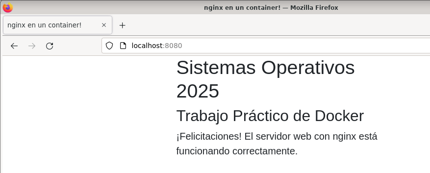
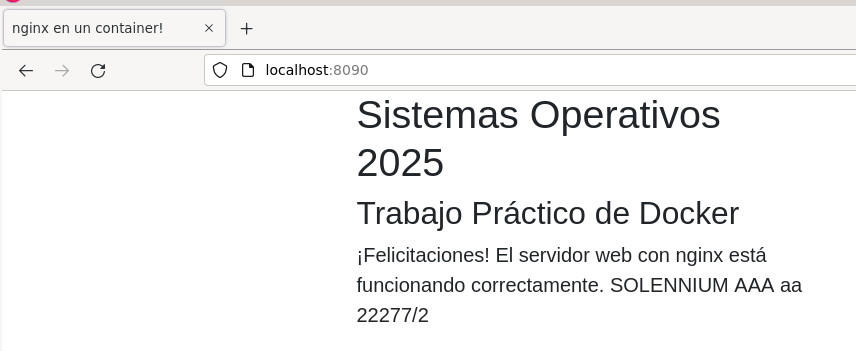
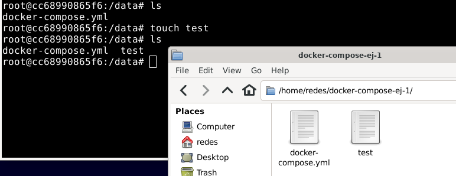
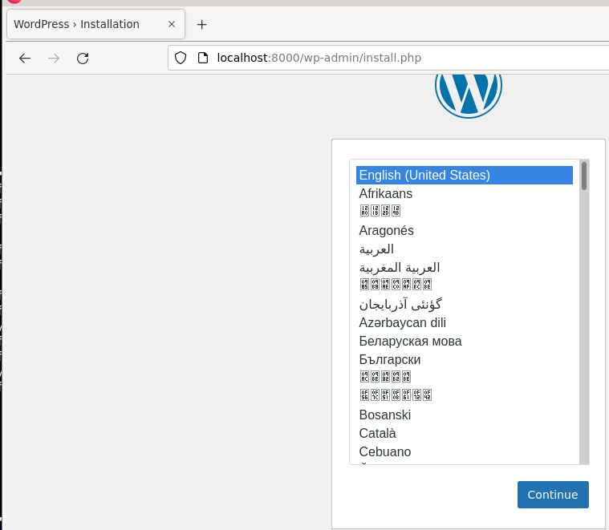

# Sistemas Operativos - Práctica 4B [2025]: Docker y Docker Compose 

## Docker 
1. Utilizando sus palabras, describa qué es Docker y enumere al menos dos beneficios que encuentre para el concepto de contenedores.

Docker es la teconología de organización (crear, desplegar, ejecutar, actualizar y administrar) en contenedores. Se usan estos como máquinas virtuales muy livianas y modulares. Los **contenedores** son unidades de software ejecutable que empaquetan el código de la aplicación con sus librerías y dependencias lo que permite que puedan ejecutarse en cualquier entorno [^3]. Utiliza los cgroups y los namespaces para dividir los procesos y ejecutarlos de manera independiente. El propósito de los contenedores es ejecutar varios procesos y aplicaciones por separado para que se pueda aprovechar mejor la infraestructura y, al mismo tiempo, conservar la seguridad que se obtendría con los sistemas individuales. [^1]
Los contenedores permiten que varios componentes de la aplicación compartan los recursos de una única instancia del sistema operativo anfitrión. Este uso compartido es similar a la forma en que un hipervisor permite que varias máquinas virtuales (VM) compartan la unidad central de procesamiento (CPU), la memoria y otros recursos de un único servidor de hardware[^2].

Ventajas: 
- **Restauración**: todas las imágenes cuentan con capas por lo tanto se la puede restaurar a una versión anterior. Respalda el engoque de desarrollo ágil.
- **Implementación rápida**: Cada proceso se encuentra en un contenedor distinto, por lo que puede compartirlos con aplicaciones nuevas rápidamente.

2. ¿Qué es una imagen? ¿y un contenedor? ¿ cuál es la principal diferencia entre ambos? 
Como se mencionó antes, un **contenedor** es una unidad de software ejecutable en el que se encuentra empaquetado el código y sus dependencias. 
Las **imágenes** [^4] contienen código fuente de la aplicación ejecutable y todas las herramientas, bibliotecas y dependencias que el código de la aplicación necesita para ejecutar como contenedor. Se componen de capas, y cada capa corresponde a una versión de la imagen. Cada vez que un desarrollador realiza cambios en la imagen, se crea una nueva capa superior y esta capa superior reemplaza a la capa superior anterior como la versión actual de la imagen. Las capas anteriores se guardan para retrocesos o para reutilizarlas en otros proyectos.

> Un contenedor es una instancia en ejecución de una imagen. Es el entorno aislado donde realmente se ejecuta la aplicación. A partir de la imagen, al crear el contenedor se crea otra capa (_capa de contenedor_) que es R/W pero no persiste más allá de la vida del contenedor. 

3. ¿Qué es **Union Filesystem**? ¿Cómo lo utiliza Docker? 
**Union Filesystem (UnionFS)** es un sistema de archivos que permite combinar múltiples capas (layers) de sistemas de archivos en una sola vista unificada. Es decir, puede montar varias capas como si fueran una sola, permitiendo que algunas sean de solo lectura y otras de lectura-escritura.
Docker usa UnionFS para construir y gestionar imágenes de forma eficiente. Las imágenes de Docker están compuestas por capas apiladas, donde cada capa representa un cambio (como instalar un paquete o copiar un archivo).
**Ventajas de usar UnionFS en Docker:**
- **Reutilización**: Si varias imágenes comparten una misma capa (como la base python:3.11), Docker la descarga una sola vez.
- **Eficiencia**: Solo se almacenan y transfieren los cambios.
- **Rapidez**: Al construir imágenes, Docker usa caché de capas anteriores si no han cambiado.
- **Inmutabilidad**: Las capas inferiores no se modifican, mejorando la seguridad y estabilidad.

4. ¿Qué rango de direcciones IP utilizan los contenedores cuando se crean? ¿De dónde la obtiene?
Por defecto, Docker asigna direcciones IP a los contenedores desde una subred interna cuando se utiliza la red puente (_bridge_). La red puente utiliza IPAM (IP Address Management) para asignar direcciones IP automáticamente lo que permite la comunicación con otros contenedores en el mismo puente[^5].
El rango más común es `172.17.0.0/16`

5. ¿De qué manera puede lograrse que las datos sean persistentes en Docker? ¿Qué dos maneras hay de hacerlo? ¿Cuáles son las diferencias entre ellas?
Por defecto, cuando un contenedor se elimina, sus datos también se pierden (_capa de contenedor_). Existen dos maneras para evitarlo[^6]:
- **Volumes**: monta el directorio en una ruta interna de Docker (administrados directamente por la API de Docker). Los volúmenes son compatibles con contenedores de diferentes SO. Como ventaja se tiene que compartir volúmenes entre varios contenedores es más seguro.  
- **Bind mounts**: permite montar un archivo o directorio desde el _host_ en el contenedor el que es accesible por un path absoluto pero dependen del SO y el filesystem del host. Es beneficioso cuando se usa al momento de desarrollar ya que se puede montar un bind mount al código fuente por lo tanto el contenedor ve los cambios que se realizan en el código de forma inmediata[^7]. 

| Característica | **Volúmenes**                           | **Bind Mounts**                         |
| -------------- | --------------------------------------- | --------------------------------------- |
| Gestión        | Docker los gestiona automáticamente     | El usuario gestiona la ruta manualmente |
| Portabilidad   | Más portables (independientes del host) | Menos portables (dependen del sistema)  |
| Seguridad      | Más seguros (aislados del host)         | Menos seguros (acceso directo al host)  |
| Rendimiento    | Mejor rendimiento en Docker Desktop     | Puede ser más lento o variable          |
| Uso típico     | Producción, bases de datos              | Desarrollo, acceso directo a archivos   |

## Taller
**El siguiente taller le guiará paso a paso para la construcción de una imagen Docker utilizando dos mecanismos distintos para los cuales deberá investigar y documentar qué comandos y argumentos utiliza para cada caso.**

1. Instale Docker CE (Community Edition) en su sistema operativo. Ayuda: seguir las instrucciones de la página de Docker. La instalación más simple para distribuciones de GNU/Linux basadas en Debian es usando los repositorios.

> Usaremos el SO otorgada en la cátedra de redes del año pasado equisde.

2. Usando las herramientas (comandos) provistas por Docker realice las siguientes tareas:
- Obtener una imagen de la última versión de Ubuntu disponible. ¿Cuál es el tamaño en disco de la imagen obtenida? ¿Ya puede ser considerada un contenedor? ¿Qué significa lo siguiente: _Using default tag: latest_?

Mediante el comando traemos una imagen desde DockerHub. Al no especificar la versión nos trae la última versión estable [^8].  
```bash
docker pull ubuntu
```
Aplicación: 
```bash
redes@debian:~$ docker pull ubuntu
Using default tag: latest
latest: Pulling from library/ubuntu
0622fac788ed: Pull complete 
Digest: sha256:6015f66923d7afbc53558d7ccffd325d43b4e249f41a6e93eef074c9505d2233
Status: Downloaded newer image for ubuntu:latest
docker.io/library/ubuntu:latest
```
Con el comando `docker images` podemos observarel listado de imagenes que tenemos con el detalle
```bash
redes@debian:~$ docker images
REPOSITORY                                  TAG       IMAGE ID       CREATED        SIZE
ubuntu                                      latest    a0e45e2ce6e6   2 weeks ago    78.1MB
hello-world                                 latest    74cc54e27dc4   3 months ago   10.1kB

```
No se puede considerar un contenedor porque para eso es necesario levantar la imagen con `docker run`

- De la imagen obtenida en el punto anterior iniciar un contenedor que
simplemente ejecute el comando `ls -l`.
Levantamos el contenedor y abrimos la shell. 
```bash
# docker run -it ubuntu bash
redes@debian:~$ docker run -it ubuntu bash
root@2e570bd38b92:/# ls -l
total 48
lrwxrwxrwx   1 root root    7 Apr 22  2024 bin -> usr/bin
drwxr-xr-x   2 root root 4096 Apr 22  2024 boot
drwxr-xr-x   5 root root  360 May 17 02:26 dev
drwxr-xr-x   1 root root 4096 May 17 02:26 etc
drwxr-xr-x   3 root root 4096 Apr 15 14:11 home

```

- ¿Qué sucede si ejecuta el comando `docker [container] run ubuntu /bin/bash`?
Si la imagen no existe en el sistema local lo descarga desde DockerHub y crea un nuevo contenedor a partir la imagen. El comando ejecuta `/bin/bash` dentro del contenedor.  

> aksjdnaks yo ejecuté con la shell interactiva de una por la documentación pero en realidad lo que se busca es ver que se ejecuta la shell pero al faltar el flag `-it` no se pueda interactuar con él, entonces el contenedor se detiene inmediatamente luego de iniciarse. 

- ¿Cuál es el PID del proceso bash en el contenedor? ¿Y fuera de éste?
Obtenemos el PID con `echo $$`. Dentro del contenedor nos imprime `1`.  
Fuera del contenedor aplicando: `docker inspect --format '{{.State.Pid}}' 92ff8c98a711 <CONTAINER_ID>` nos sale `3250`. 
Son diferentes porque el contenedor tiene su propio espacio de procesos aislado (namespace)

- Ejecutar el comando `lsns`. ¿Qué puede decir de los namespace?
```bash
root@92ff8c98a711:/# lsns
        NS TYPE   NPROCS PID USER COMMAND
4026531834 time        2   1 root bash
4026531837 user        2   1 root bash
4026532167 mnt         2   1 root bash
4026532168 uts         2   1 root bash
4026532169 ipc         2   1 root bash
4026532170 pid         2   1 root bash
4026532171 cgroup      2   1 root bash
4026532173 net         2   1 root bash
```
Todos los namespaces tienen el mismo PID que es el del bash del contenedor. 
Si ejecuto `lsns` desde el lado del host me salen diferentes id de namespaces lo que me confirma que el contenedor está correctamente aislado. 

- Dentro del contenedor cree un archivo con nombre sistemas-operativos en el directorio raíz del filesystem y luego salga del contenedor (finalice la sesión de Bash utilizando las teclas Ctrl + D o el comando `exit`).
- Corrobore si el archivo creado existe en el directorio raíz del sistema operativo anfitrión (host). ¿Existe? ¿Por qué?
No existe porque los contenedores tienen un sistema de archivos aislados del host, desaparece cuando el contenedor se elimina.

- Vuelva a iniciar el contenedor anterior utilizando el mismo comando (con una terminal interactiva). ¿Existe el archivo creado en el contenedor? ¿Por qué?
Por los mismos motivos que se explicaron antes y al inicio la capa de escritura se genera con cada contenedor y es efímero, por lo tanto no persiste los datos a menos que usemos volumes o bind mounts. 
```bash
root@92ff8c98a711:/# touch sistemas-operativos.txt
root@92ff8c98a711:/# ls
bin   dev  home  lib64  mnt  proc  run   sistemas-operativos.txt  sys  usr
boot  etc  lib   media  opt  root  sbin  srv                      tmp  var
root@92ff8c98a711:/# exit
exit
redes@debian:~$ docker run -it ubuntu bash
root@ca3073f34b64:/# ls
bin  boot  dev  etc  home  lib  lib64  media  mnt  opt  proc  root  run  sbin  srv  sys  tmp  usr  var
```

/ Obtenga el identificador del contenedor (container_id) donde se creó el archivo y utilícelo para iniciar con el comando `docker start -ia container_id` el contenedor en el cual se creó el archivo.
i. ¿Cómo obtuvo el container_id para para este comando?
Mediante `docker ps -a` que lista contenedores que existen aunque estén detenidos.
ii. Chequee nuevamente si el archivo creado anteriormente existe. ¿Cuáles el resultado en este caso? ¿Puede encontrar el archivo creado?

```bash
redes@debian:~$ docker start -ia 92ff8c98a711
ls
bin   dev  home  lib64  mnt  proc  run   sistemas-operativos.txt  sys  usr
boot  etc  lib   media  opt  root  sbin  srv                      tmp  var
```
El archivo creado existe, Docker guarda el sistema de archivos del contenedor incluso si está detenido a menos que se lo elimine explícitamente con `docker rm <container_id>`

- ¿Cuántos contenedores están actualmente en ejecución? ¿En qué estado se encuentra cada uno de los que se han ejecutado hasta el momento?
Con `docker ps` se muestran los contenedores en ejecución. 
- Elimine todos los contenedores creados hasta el momento. Indique el o los comandos utilizados.
Con `docker rm $(docker ps -aq)` se eliminan todos los contenedores pero como tengo virtualizado hay contenedores que mantienen el sistema así que manualmente con el ID de los contenedores lo eliminaremos con el mismo comando (`docker rm <container_id>`). 

3. Creación de una imagen a partir de un contenedor. Siguiendo los pasos indicados a continuación genere una imagen de Docker a partir de un contenedor:
a. Inicie un contenedor a partir de la imagen de Ubuntu descargada anteriormente ejecutando una consola interactiva de Bash.
b. Instale el servidor web Nginx, https://nginx.org/en/, en el contenedor utilizando los siguientes comandos[^9]:
```bash
export DEBIAN_FRONTEND=noninteractive
export TZ=America/Buenos_Aires
apt update -qq
apt install -y --no-install-recommends nginx
```
c. Salga del contenedor y genere una imagen Docker a partir de éste. ¿Con qué nombre se genera si no se especifica uno?
        Obtenemos el id del contenedor y aplicamos el comando `docker commit <CONTAINER_ID> nombre-de-la-imagen`. En el caso de que no se le coloque un nombre a la imagen se le asigna un ID aleatorio. 
```bash
root@ee389f222121:/# nginx -v       
nginx version: nginx/1.24.0 (Ubuntu)
root@ee389f222121:/# exit
exit
redes@debian:~$ docker commit ee389f222121
sha256:16991ecbc3502c26aec17b6572bf24df92eb1883bd90c75f853d60eedc4aee4b
redes@debian:~$ docker images
REPOSITORY                                  TAG       IMAGE ID       CREATED          SIZE
<none>                                      <none>    16991ecbc350   24 seconds ago   135MB
```
d. Cambie el nombre de la imagen creada de manera que en la columna Repository aparezca `nginx-so` y en la columna Tag aparezca `v1`.
        Copiamos el id de la imagen que aparece en el listado dado por el comando `docker images` y ejecutamos luego `docker tag <IMAGE ID> nombre[:tag]`
```bash
redes@debian:~$ docker tag sha256:16991ecbc3502c26aec17b6572bf24df92eb1883bd90c75f853d60eedc4aee4b nginx-so:v1
redes@debian:~$ docker images
REPOSITORY                                  TAG       IMAGE ID       CREATED         SIZE
nginx-so                                    v1        16991ecbc350   3 minutes ago   135MB

```
e. Ejecute un contenedor a partir de la imagen nginx-so:v1 que corra el servidor web nginx atendiendo conexiones en el puerto 8080 del host, y sirviendo una página web para corroborar su correcto funcionamiento. Para esto:
I. En el Sistema Operativo anfitrión (host) sobre el cual se ejecuta Docker crear un directorio que se utilizará para este taller. Éste puede ser el directorio nginx-so dentro de su directorio personal o cualquier otro directorio - para los fines de este enunciado haremos referencia a éste como `/home/so/nginx-so`, por lo que en los lugares donde se mencione esta ruta usted deberá reemplazarla por la ruta absoluta al directorio que haya decidido crear en este paso.
II. Dentro de ese directorio, cree un archivo llamado `index.html` que contenga el código HTML de este gist de GitHub: https://gist.github.com/ncuesta/5b959fce1c7d2ed4e5a06e84e5a7efc8.
III. Cree un contenedor a partir de la imagen `nginx-so:v1` montando el directorio del host (`/home/so/nginx-so`) sobre el directorio `/var/www/html` del contenedor, mapeando el puerto 80 del contenedor al puerto 8080 del host, y ejecutando el servidor nginx en primer plano[^10]. Indique el comando utilizado.
```
docker run -p 8080:80 -v /home/redes/nginx-so:/var/www/html nginx-so:v1 nginx -g "daemon off;"
```
        - `-p`: para mapear el puerto local al 80 del contenedor.
        - `-v`: monta la carpeta local dentro del contenedor. 
        - `nginx -g "daemon off;"`: arranca nginx en primer plano.

f. Verifique que el contenedor esté ejecutándose correctamente abriendo un navegador web y visitando la URL http://localhost:8080.

g. Modifique el archivo index.html agregándole un párrafo con su nombre y número de alumno. ¿Es necesario reiniciar el contenedor para ver los cambios?
        No, no es necesario porque es un volumen del tipo _bind mount_, o sea que cualquier cambiao que se realice en el directorio del host se regleja de forma inmediata en el contenedor. 
h. Analice: ¿por qué es necesario que el proceso nginx se ejecute en primer plano? ¿Qué ocurre si lo ejecuta sin -g 'daemon off;'?
        Docker mantiene en ejecución un contenedor mientras el proceso principal que se lanzó no termine, o sea, si no se lanza con la opción de primer plano el proceso principal finaliza y nginx queda en modo daemon por lo tanto interpreta que la ejecución terminó y procede a detenerlo. 

4. Creación de una imagen Docker a partir de un archivo Dockerfile. Siguiendo los pasos indicados a continuación, genere una nueva imagen a partir de los pasos descritos en un Dockerfile.
a. En el directorio del host creado en el punto anterior (`/home/so/nginx-so`), cree un archivo Dockerfile que realice los siguientes pasos:
i. Comenzar en base a la imagen oficial de Ubuntu.
ii. Exponer el puerto 80 del contenedor.
iii. Instalar el servidor web nginx.
iv. Copiar el archivo `index.html` del mismo directorio del host al directorio `/var/www/html` de la imagen.
v. Indicar el comando que se utilizará cuando se inicie un contenedor a partir de esta imagen para ejecutar el servidor nginx en primer plano: `nginx -g 'daemon off;'`. Use la forma exec[^11] para definir el comando, de manera que todas las señales que reciba el contenedor sean enviadas directamente al proceso de nginx. Ayuda: las instrucciones necesarias para definir los pasos en el Dockerfile son FROM, EXPOSE, RUN, COPY y CMD.
> RUN: Ejecuta un comando en tiempo de construcción de la imagen Docker y por lo tanto el resultado se guarda en la imagen.

```dockerfile
FROM ubuntu:25.10

EXPOSE 80

RUN DEBIAN_FRONTEND=noninteractive
RUN TZ=America/Buenos_Aires
RUN apt update -qq
RUN apt install -y --no-install-recommends nginx 
# Remuevo los archivos intermedios y auxiliares para que la imagen no pese mucho je
RUN apt clean && rm -rf /var/lib/apt/lists/* 

COPY index.html /var/www/html

CMD ["nginx", "-g", "daemon off;"]

```
> Solo puede haber una instrucción CMD en un Dockerfile (la última si hay varias). Ésta se ejecuta al iniciar el contenedor. 

b. Utilizando el Dockerfile que generó en el punto anterior construya una nueva imagen Docker guardándola localmente con el nombre nginx-so:v2.
```bash
redes@debian:~/nginx-so$ docker build -t nginx-so:v2 .
```
c. Ejecute un contenedor a partir de la nueva imagen creada con las opciones adecuadas para que pueda acceder desde su navegador web a la página a través del puerto 8090 del host. Verifique que puede visualizar correctamente la página accediendo a http://localhost:8090.
```bash
redes@debian:~/nginx-so$ docker run -p 8090:80 nginx-so:v2
```


d. Modifique el archivo index.html del host agregando un párrafo con la fecha actual y recargue la página en su navegador web. ¿Se ven reflejados los cambios que hizo en el archivo? ¿Por qué?
        No, no se porque no se montó un volumen desde el host como en el caso anterior. 
e. Termine el contenedor iniciado antes y cree uno nuevo utilizando el mismo comando. Recargue la página en su navegador web. ¿Se ven ahora reflejados los cambios realizados en el archivo HTML? ¿Por qué?
        Tampoco se muestran porque el contenedor se creo a partir de la imagen anterior por lo tanto tiene una copia de los archivos del momento en que se creo la imagen. 
f. Vuelva a construir una imagen Docker a partir del Dockerfile creado anteriormente, pero esta vez dándole el nombre nginx-so:v3. Cree un contenedor a partir de ésta y acceda a la página en su navegador web. ¿Se ven reflejados los cambios realizados en el archivo HTML? ¿Por qué?
        Sí, se ve reflejado el cambio porque se reconstruyó la imagen con los archivos actualizados. 


## Docker Compose 
1. Utilizando sus palabras describa, ¿qué es docker compose?
        **Docker Compose** es una herramienta para definir y ejecutar aplicaciones de Docker de varios contenedores. En Compose, se usa un archivo YAML para configurar los servicios de la aplicación. Después, con un solo comando, se crean y se inician todos los servicios de la configuración.
2. ¿Qué es el archivo compose y cual es su función? ¿Cuál es el “lenguaje” del archivo[^12]?
        El archivo `docker-compose.yml` es el archivo de configuración que define la configuración para ejecutar contenedores Docker. Define qué imágenes usar o cómo construirlas, qué volúmenes usar, configurar las redes, variables de entorno, etc. 
        El archivo está escrito en YAML (Yet Another Markup Language), un lenguaje de marcado.
3. ¿Cuáles son las versiones existentes del archivo `docker-compose.yaml` existentes y qué características aporta cada una? ¿Son compatibles entre sí?¿Por qué?
        - version "1": Muy básica, no soporta redes personalizadas ni volúmenes nombrados. Ya está obsoleta.
        - version "2":Introdujo el soporte para redes, volúmenes y dependencias entre servicios (depends_on).
        - version "3": Orientada a Docker Swarm (orquestación). Introduce deploy, replicas, etc.
        No son totalmente compatibles entre sí ya que hay instrucciones que están disponibles solo en ciertas versiones pero sí es retrocopatible por lo que versiones anteriores pueden funcionar si no se usan funcionalidades avanzadas.  

4. Investigue y describa la estructura de un archivo compose. Desarrolle al menos sobre los siguientes bloques indicando para qué se usan:
a. `services`: define los contenedores (aplicaciones/servicios) que se levantarán. 
b. `build`: construye una imagen desde un Dockerfile en vez de usar una imagen preexistente. 
c. `image`: la imagen Docker que se usará para ese servicio. 
d. `volumes`: Monta volúmenes del host o nombrados dentro del contenedor. 
e. `restart`: se indica la política de reinicio del contenedor si por cualquier condición se para.
f. `depends_on`: Indica la dependencia entre contenedores. No se va a iniciar un contenedor hasta que otro este funcionando. 
g. `environment`: define variables de entorno para el contenedor. 
h. `ports`: mapea puertos del contenedor al host. 
i. `expose`:  Expone uno o varios puertos dentro de la red del contenedor, pero no los publica al host. Es útil cuando se quiere que otros servicios dentro de la misma red de Docker puedan acceder a ese puerto, pero no desde afuera. 
j. `networks`: define una o más redes virtuales para que los contenedores se comuniquen entre sí. Permite aislar servicios y controlar cómo se conectan. 

```yaml
version: "3.8"       # Versión del esquema de Compose

services:            # Bloque principal: define los contenedores
  web:               # Nombre del servicio
    image: nginx     # Imagen usada
    ports:
      - "8080:80"    # Mapeo de puertos (host:contenedor)
    volumes:
      - ./html:/usr/share/nginx/html  # Montaje de volumen

volumes:             # (Opcional) Volúmenes nombrados
  data-volume:

networks:            # (Opcional) Redes definidas
  my-network:

```

5. Conceptualmente: ¿Cómo se podrían usar los bloques `healthcheck` y `depends_on` para ejecutar una aplicación Web dónde el backend debería ejecutarse si y sólo si la base de datos ya está ejecutándose y lista?
        En aplicaciones web, si el backend intenta conectarse a la base de datos antes de que esté lista, puede fallar. Esto ocurre porque `depends_on` solo asegura que un contenedor se inicie, pero no que esté listo. El bloque `healthcheck` permite definir una prueba que verifica si un contenedor está funcionando correctamente (como que constantemente hace un pull para revisar si el contenedor funciona ok). 

6. Indique qué hacen y cuáles son las diferencias entre los siguientes comandos:

| Comando                 | ¿Qué hace?                                                                                  |
| ----------------------- | ------------------------------------------------------------------------------------------- |
| `docker compose create` | **Crea los contenedores** definidos en el `docker-compose.yml` pero **no los inicia**.      |
| `docker compose up`     | Crea **y también inicia** los contenedores. Puede levantar redes y volúmenes si no existen. |

| Comando               | ¿Qué hace?                                                               |
| --------------------- | ------------------------------------------------------------------------ |
| `docker compose stop` | **Detiene** los contenedores pero **los conserva** (podés reiniciarlos). |
| `docker compose down` | Detiene **y elimina** los contenedores, redes y otros recursos creados.  |

| Comando               | ¿Qué hace?                                                      |
| --------------------- | --------------------------------------------------------------- |
| `docker compose run`  | Crea y ejecuta un nuevo contenedor temporal para un servicio.   |
| `docker compose exec` | Ejecuta un comando dentro de un contenedor **ya en ejecución**. |

d. `docker compose ps`: Muestra el estado de los servicios definidos en el `docker-compose.yml`. Se muestran columnas como el nombre del contenedor, el estado y los puertos mapeados. 
e. `docker compose logs`: Muestra los logs de los contenedores de los servicios definidos. 

7. ¿Qué tipo de volúmenes puede utilizar con docker compose? ¿Cómo se declara cada tipo en el archivo compose?
Se puede usar los dos tipos de volúmenes explicados en puntos anteriores: nombrados y bind mounts. 
En el caso del **nombrado**:
```yaml
services:
  app:
    volumes:
      - mydata:/app/data #Se crea un volumen y se monta en el contenedor en la ruta /app/data
```

En el caso del **bind mount**:
```yml
services:
  web:
    volumes:
      - ./html:/usr/share/nginx/html # El directorio local ./html se monta dentro del contenedor
```

8. ¿Qué sucede si en lugar de usar el comando `docker compose down` utilizo `docker compose down -v/--volumes`?
Si se usa `docker compose down -v` hace lo mismo que `docker compose down` pero también elimina los volúmenes y los datos que éstos contengan. Es útil para cuando se quiere resetear el estado de la app eliminando los datos persistentes.  

### Instalación de Docker compose
En la práctica anterior se instaló el entorno de ejecución Docker-CE. Es requisito para esta práctica tener dicho entorno instalado y funcionando en el dispositivo donde se pretenda realizar la misma.
En el sitio https://docs.docker.com/compose/install/ se puede encontrar la guía para instalar docker-compose en distintos SO.
Docker-compose es simplemente un binario, por lo que lo único que se necesita es descargar el binario, ubicarlo en algún lugar que el PATH de nuestro dispositivo pueda encontrarlo y que tenga los permisos necesarios para ser ejecutado.
En la actualidad existen 2 versiones del binario docker-compose. Vamos a utilizar la versión 2. Para instalar la versión 2.18.1, vamos a descargarla y ubicarla en el directorio `/usr/local/bin/docker-compose`, para que de esta manera quede accesible mediante el PATH de nuestra CLI:
```bash
~$ sudo curl -SL
https://github.com/docker/compose/releases/download/v2.18.1/docker-compo
se-linux-x86_64 -o /usr/local/bin/docker-compose
```
Una vez descargado, le damos permiso de ejecución: `~$ sudo chmod +x /usr/local/bin/docker-compose`
De esta manera ya tendremos docker-compose disponible. Para asegurarnos que esté instalado correctamente, verificamos la versión instalada corriendo desde la consola:
```bash
~$ docker compose --version
Docker Compose version v2.18.1
```
> En mi caso como instalé Docker Desktop me vino incluido y tengo la versión v2.35.1

### Ejercicio guiado - Instanciando un Wordpress y una Base de Datos 
Dado el siguiente archivo compose:
```yml
version: "3.9"
        services:
                db:
                        image: mysql:5.7
                        networks:
                                - wordpress
                        volumes:
                                - db_data:/var/lib/mysql
                        restart: always
                        environment:
                                MYSQL_ROOT_PASSWORD: somewordpress
                                MYSQL_DATABASE: wordpress
                                MYSQL_USER: wordpress
                                MYSQL_PASSWORD: wordpress
                wordpress:
                        depends_on:
                                - db
                        image: wordpress:latest
                        networks:
                                - wordpress
                        volumes:
                                - ${PWD}:/data
                                - wordpress_data:/var/www/html
                        ports:
                                - "127.0.0.1:8000:80"
                        restart: always
                        environment:
                                WORDPRESS_DB_HOST: db
                                WORDPRESS_DB_USER: wordpress
                                WORDPRESS_DB_PASSWORD: wordpress
                                WORDPRESS_DB_NAME: wordpress
        volumes:
                db_data: {}
                wordpress_data: {}
        networks:
                wordpress:
```
Intente analizar el código ANTES de correrlo y responda: 
- ¿Cuántos contenedores se instancian?
        Se instancian dos contenedores: db y wordpress.
- ¿Por qué no se necesitan Dockerfiles?
        Porque se usa una imagen ya hecha: `wordpress:latest` y `mysql:5.7`. Además no está la instrucción `build` que indica que se genere la imagen a partir de un Dockerfile. 
- ¿Por qué el servicio identificado como `wordpress` tiene la siguiente línea?
```yml
depends_on:
        - db
```
        Porque es necesario que se levante el contenedor de wordpress sólo si la base de datos se levantó correctamente para evitar que el sitio envíe solicitudes a la base de datos y ésta no se encuentre lista.  
- ¿Qué volúmenes y de qué tipo tendrá asociado cada contenedor? 
        En el caso de `db` se usa el volumen nombrado. Para `wordpress` se usan dos volúmenes uno que es bind mount (se usa la variable de entorno `PWD`) y uno nombrado. 
- Por qué uso el volumen nombrado `volumes: - db_data:/var/lib/mysql` para el servicio `db` en lugar de dejar que se instancie un volumen anónimo con el contenedor?
        Porque una vez que el contenedor se detenga los datos no tendrán persistencia por lo tanto se reiniciará cada vez. 
- ¿Qué genera la línea `volumes: - ${PWD}:/data` en la definición de wordpress?
        Genera un volumen del tipo bind mount ya que se enlaza con el path absoluto del directorio en donde se encuentre el archivo `docker-compose.yml`. 
- ¿Qué representa la información que estoy definiendo en el bloque `environment` de cada servicio?¿Cómo se “mapean” al instanciar los contenedores?
        Representan las variables de entorno que se inyectan dentro de los contenedores cuando se inicia. 
        Cuando Docker Compose levanta un contenedor, cada variable del bloque environment se convierte en una variable de entorno dentro del sistema del contenedor igual que se hiciera en Linux lo siguiente: `export MYSQL_ROOT_PASSORD=unaclave`
- ¿Qué sucede si cambio los valores de alguna de las variables definidas en bloque `environment` en solo uno de los contenedores y hago que sean diferentes? (Por ej: cambio SOLO en la definición de `wordpress` la variable `WORDPRESS_DB_NAME`)
        Para el ejemplo se intentaría conectar a una base de datos inexistentes. Entonces, en caso de cambiar los valores puede generar errores de autenticación, error en los permisos o error al conectar.
- ¿Cómo sabe comunicarse el contenedor “wordpress” con el contenedor “db” si nunca doy información de direccionamiento?
        Por la definición de la red (`network`) conecta a ambos servicios a un mismo brigde (red virtual llamada `wordpress`). 
- ¿Qué puertos expone cada contenedor según su Dockerfile? (pista: navegue el sitio https://hub.docker.com/_/wordpress y https://hub.docker.com/_/mysql para acceder a los Dockerfiles que generaron esas imágenes y responder esta pregunta.)
        En el caso de mysql se expone el puerto :3306
        Para wordpress se expone el puerto 80

> El comando EXPOSE (Dockerfile) es diferente al PORT (docker-compose): el primero expone el puerto para que el resto de contenedores acceda. 

- ¿Qué servicio se “publica” para ser accedido desde el exterior y en qué puerto?¿Es necesario publicar el otro servicio? ¿Por qué?
        Se publica el contenedor de wordpress para que sea accesible por fuera del contenedor, por ejemplo desde el navegador del host. No es necesario publicar el otro servicio porque sólo lo consume el contenedor de wordpress además es seguro que solo se permita esa conexión. 

### Instanciando
Cree un directorio llamada `docker-compose-ej-1` donde prefiera, ubíquese dentro de éste y cree un archivo denominado `docker-compose.yml` pegando dentro el código anterior.
La herramienta docker-compose, por defecto, espera encontrar en el directorio desde donde se la invoca un archivo `docker-compose.yml` (por eso lo creamos con ese nombre). Si existe, lee este archivo compose y realiza el despliegue de los recursos allí definidos.
Ahora, desde ese directorio ejecute el comando `docker compose up`, lo que resulta en el comienzo del despliegue de nuestros servicios. Como es la primera vez que lo corremos y si no tenemos las imágenes en la caché local de nuestro dispositivo, se descargan las imágenes de los dos servicios que estamos iniciando (recordar lo visto en la práctica anterior).

En este punto, quedará la consola conectada a los servicios y estaremos viendo los logs exportados de los servicios. Si cerramos la consola o detenemos el proceso con `ctrl+c`, los servicios se darán de baja porque iniciamos los servicios en modo foreground. Para no quedar “pegados” a la consola podemos iniciar los servicios en modo “detached” de modo que queden corriendo en segundo plano (background), igual que como se hace con el comando `docker run -d IMAGE`:
```bash
~$ docker compose up -d
```
Podemos ver como se levantaron los dos contenedores:
```
redes@debian:~/docker-compose-ej-1$ docker compose ps
NAME                              IMAGE              COMMAND                  SERVICE     CREATED         STATUS         PORTS
docker-compose-ej-1-db-1          mysql:5.7          "docker-entrypoint.s…"   db          2 minutes ago   Up 4 seconds   3306/tcp, 33060/tcp
docker-compose-ej-1-wordpress-1   wordpress:latest   "docker-entrypoint.s…"   wordpress   2 minutes ago   Up 3 seconds   127.0.0.1:8000->80/tcp

```
De esta manera veremos sólo información de que los servicios se inician y su nombre, pero la consola quedará “libre”.
Si quisiéramos conectarnos a alguno de los contenedores que docker-compose inició, por ejemplo el contenedor de wordpress, podemos hacerlo de la manera tradicional que se vio en la práctica de Docker (`docker exec [OPTIONS] CONTAINER COMMAND [ARG...]`) utilizando el identificador apropiado para el contenedor, o mediante el comando que docker-compose también brinda para hacerlo y usar su nombre de servicio (“wordpress” en este caso):
```bash
~$ docker compose exec wordpress /bin/bash
root@4dd0bcce2cb1:/var/www/html#

```
Aquí puedo enviar el comando `/bin/bash` porque el contenedor lo soporta; si eso no funcionase, la mayoría soportan al menos `/bin/sh`.
Y una vez dentro del contenedor, puedo navegar sus directorios normalmente. Si nos dirigimos al directorio `/data`, veremos dentro el contenido de nuestro directorio `docker-compose-ej-1` (solo tenemos el archivo `docker-compose.yml`) ya que montamos ese directorio como un volumen:
```bash
root@4dd0bcce2cb1:/var/www/html# cd /data/
root@4dd0bcce2cb1:/data# ls
docker-compose.yml
```
Entramos al contenedor con los comandos indicados: 
```bash
root@cc68990865f6:/var/www/html# ls
index.php    wp-activate.php	 wp-comments-post.php  wp-config.php  wp-includes	 wp-login.php	  wp-signup.php
license.txt  wp-admin		 wp-config-docker.php  wp-content     wp-links-opml.php  wp-mail.php	  wp-trackback.php
readme.html  wp-blog-header.php  wp-config-sample.php  wp-cron.php    wp-load.php	 wp-settings.php  xmlrpc.php

```


Ahora que tenemos todo instanciado y funcionando, vamos a listar los servicios que iniciamos. Para esto vamos a correr `docker compose ps`: 
```bash
redes@debian:~/docker-compose-ej-1$ docker compose ps
NAME                              IMAGE              COMMAND                  SERVICE     CREATED          STATUS         PORTS
docker-compose-ej-1-db-1          mysql:5.7          "docker-entrypoint.s…"   db          11 minutes ago   Up 8 minutes   3306/tcp, 33060/tcp
docker-compose-ej-1-wordpress-1   wordpress:latest   "docker-entrypoint.s…"   wordpress   10 minutes ago   Up 8 minutes   127.0.0.1:8000->80/tcp

```
Como se puede observar, el servicio denominado `docker-compose-ej-1_wordpress_1` está exponiendo el puerto 80 del contenedor en la dirección `127.0.0.1` puerto `8000` de nuestro dispositivo “host”. Esto quiere decir que tenemos en nuestro dispositivo un puerto 8000 “abierto” aceptando conexiones y si ingresamos desde un navegador a la direccion `127.0.0.1:8000` veremos la página de inicio de la aplicación Wordpress:


De este modo, hemos realizado el despliegue de una aplicación wordpress y de su base de datos mediante el uso de contenedores y la herramienta docker-compose. Desde este punto, solo queda continuar con la instalación de wordpress desde el browser.
Si queremos detener los servicios podemos ejecutar el comando `docker-compose stop` y para eliminarlos `docker compose down`. Pero atención, esto elimina los contenedores pero no SUS VOLÚMENES DE DATOS, por lo que si volvemos a levantar los servicios por más que hayamos eliminado los contenedores, veremos que todas las modificaciones que hayamos realizado en la instalación de wordpress y datos agregados a la base de datos aún están presentes. Si queremos eliminar todo rastro de un despliegue previo, tendremos que eliminar los contenedores y también los volúmenes asociados utilizando el flag -v en docker-compose down, de esta forma queda `docker-compose down -v`.
De esta manera, hemos eliminado todo lo instanciado por el docker compose. Solo quedan las imágenes Docker descargadas en la caché local del dispositivo, las cuales deben eliminar por su cuenta.


[^1]: https://www.redhat.com/es/topics/containers/what-is-docker
[^2]: https://www.ibm.com/mx-es/think/topics/docker
[^3]: https://www.ibm.com/think/topics/containers?_gl=1*h54ii8*_ga*MTM5NzIzOTE0My4xNzEyMDg5OTgy*_ga_FYECCCS21D*MTc0NTk0OTAzOC4yMDkuMC4xNzQ1OTQ5MDM4LjAuMC4w
[^4]: https://www.ibm.com/mx-es/think/topics/docker#:~:text=comandos%20de%20Docker.-,Im%C3%A1genes%20de%20Docker,-Las%20im%C3%A1genes%20de
[^5]: https://interlir.com/es/2024/11/11/gestion-de-direcciones-ip-en-docker-y-kubernetes/
[^6]: https://medium.com/@williehung/persisting-data-using-docker-volume-and-bind-mount-52a8cb42f4f0
[^7]: https://medium.com/@williehung/persisting-data-using-docker-volume-and-bind-mount-52a8cb42f4f0
[^8]: https://docs.docker.com/reference/cli/docker/image/pull/
[^9]:  Los dos primeros comandos exportan dos variables de ambiente para que la instalación de una de las dependencias de `nginx` (el paquete `tzdata`) no requiera que interactivamente se respondan preguntas sobre la ubicación geográfica a utilizar
[^10]: Para iniciar el servidor nginx en primer plano utilice el comando `nginx -g 'daemon off;'`
[^11]:  La documentación oficial de Docker describe las tres formas posibles para indicar el comando principal de una imagen: https://docs.docker.com/engine/reference/builder/#cmd.
[^12]: https://www.ionos.com/es-us/digitalguide/servidores/configuracion/docker-compose-tutorial/
