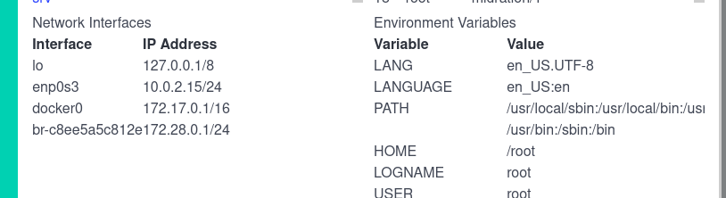

# Sistemas Operativos - Práctica 5B [2025]: Seguridad

> Notas:
    1. Utilizar un kernel completo (no el compilado en las prácticas 1 y 2).
    2. En Debian 12 (Woodworm) utilizar el kernel por defecto 6.1.0 para evitar incompatibilidades con apparmor-utils.
    3. Compilar el código C usando el Makefile provisto a fin de deshabilitar algunas medidas de seguridad del compilador y generar un código assembler más simple.
    4. Acceda al código necesario para la práctica en el repositorio de la materia.
    5. Se recomienda trabajar en una VM ya que como parte de la práctica se van ahabilitar y deshabilitar medidas de seguridad, lo que puede generar vulnerabilidades o hacer que determinadas aplicaciones no funcionen.

## D - AppArmor
1. Instale las herramientas de espacio de usuario, perfiles por defecto de app-armor y auditd (necesario para generar perfiles de forma interactiva)

```bash
apt install apparmor apparmor-profiles apparmor-utils auditd
```

2. Verifique si apparmor se encuentra habilitado con el comando `aa-enabled`. Si no se encuentra habilitado verifique el kernel que está ejecutando (el kernel de Debian de la VM lo trae habilitado por defecto).


3. Utilice la herramienta `aa-status` para determinar:
a. ¿Cuántos perfiles se encuentran cargados?
```bash
redes@debian:~$ sudo aa-status
apparmor module is loaded.
34 profiles are loaded.
17 profiles are in enforce mode.
# ...
17 profiles are in complain mode.
# ...
18 processes have profiles defined.
18 processes are in enforce mode.
   /usr/sbin/cups-browsed (780) 
   /usr/sbin/cupsd (721) 
   /usr/sbin/named (1381) docker-default
   /usr/sbin/httpd (1383) docker-default
   /usr/sbin/named (1384) docker-default
   /usr/sbin/httpd (1521) docker-default
   /usr/sbin/httpd (1522) docker-default
   /usr/sbin/httpd (1523) docker-default
   /usr/sbin/httpd (1524) docker-default
   /usr/sbin/httpd (1525) docker-default
   /usr/bin/busybox (2829) docker-default
   /usr/libexec/postfix/master (2926) docker-default
   /usr/libexec/postfix/pickup (2927) docker-default
   /usr/libexec/postfix/qmgr (2928) docker-default
   /usr/sbin/dovecot (2929) docker-default
   /usr/libexec/dovecot/anvil (2931) docker-default
   /usr/libexec/dovecot/log (2932) docker-default
   /usr/libexec/dovecot/config (2933) docker-default
0 processes are in complain mode.
0 processes are unconfined but have a profile defined.

```

b. ¿Cuántos procesos y cuáles procesos de tu sistema tienen perfiles definidos?
```bash
18 processes have profiles defined.
18 processes are in enforce mode.
   /usr/sbin/cups-browsed (780) 
   /usr/sbin/cupsd (721) 
   /usr/sbin/named (1381) docker-default
   /usr/sbin/httpd (1383) docker-default
   /usr/sbin/named (1384) docker-default
   /usr/sbin/httpd (1521) docker-default
   /usr/sbin/httpd (1522) docker-default
   /usr/sbin/httpd (1523) docker-default
   /usr/sbin/httpd (1524) docker-default
   /usr/sbin/httpd (1525) docker-default
   /usr/bin/busybox (2829) docker-default
   /usr/libexec/postfix/master (2926) docker-default
   /usr/libexec/postfix/pickup (2927) docker-default
   /usr/libexec/postfix/qmgr (2928) docker-default
   /usr/sbin/dovecot (2929) docker-default
   /usr/libexec/dovecot/anvil (2931) docker-default
   /usr/libexec/dovecot/log (2932) docker-default
   /usr/libexec/dovecot/config (2933) docker-default
```

4. Detenga y deshabilite el servicio `insecure_service` creado en la parte 1 de la práctica de forma que no vuelva a iniciarse automáticamente. 
```bash
systemctl stop insecure_service.service
systemctl disable insecure_service.service
```

5. Ejecute `insecure_service` manualmente usando el usuario root y verifique que puede acceder libremente al filesystem en http://localhost:8080 o la IP correspondiente donde se ejecuta el servicio. 
```bash
/opt/sistemasoperativos/insecure_service

```


6. Generación de un nuevo profile:
a. Ejecutar `aa-genprof /...`
b. Abrir otra terminal, ejecutar `insecure_service` y navegue el sistema de archivos usando la interfaz web provista por el servicio. 
c. Genere unperfil que permita: 
i. Abrir conexiones tcp ipv4. 
ii. Abrir conexión tcp ipv6.
iii. El perfil debe incluir lo siguientes perfiles ()y ningún otro:
1. include <abstractions/base>
2. include <abstractiones/nameservice>
iv. Listar el contenido de / y /proc pero no de otros subdirectorios de /.
v. Ejecutar con los permisos del perfil actual (mrix) los siguientes comandos: 
1. `/usr/bin/dash`
2. `/usr/bin/ip`
3. `/usr/bin/mawk`
4. `/urs/bin/ps`
7. Habilite el mofo enforcing y verifique si funciona (`aa-enforcing`).
8. Si necesita volver a generar un perfil puede usar `aa-complain` + `aa-logprofile` o editar el profile a mano y aplicar con `apparmor_parser -r`

Ayudas:
● Es útil habilitar el modo complain y volver a ejecutar `aa-genprof` para detectar más acciones y que se agreguen al profile.
● Seguro es necesario ajustar el archivo manualmente ya que `aa-genprof` no siempre muestra las opciones que necesitamos.
● Verificar que no se agreguen “include” adicionales ya que traen otras reglas que van a cambiar el comportamiento.
● Para permitir acceso a un directorio:
    ○ `/path/terminado/en/barra/ r`,
● Para permitir acceso a los subdirectorios:
    ○ `/path/terminado/en/barra/** r`,
● Para denegar es lo mismo agregando deny al principio.
● Para permitir listar / pero denegar el resto:
    ○ `/ r`,
    ○ `deny /* r`,
● owner se usa para acceder solo a los recursos de los cuales el proceso es owner. No lo usaremos en esta práctica.
● Siempre verificar que el perfil esté en enforce en las pruebas, si está en complain el  proceso podrá acceder a todos los recursos y no estaremos probando el perfil realmente.